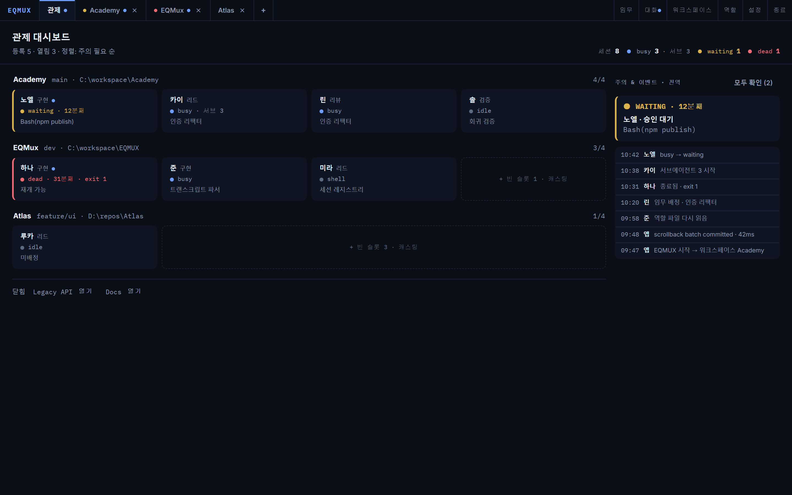
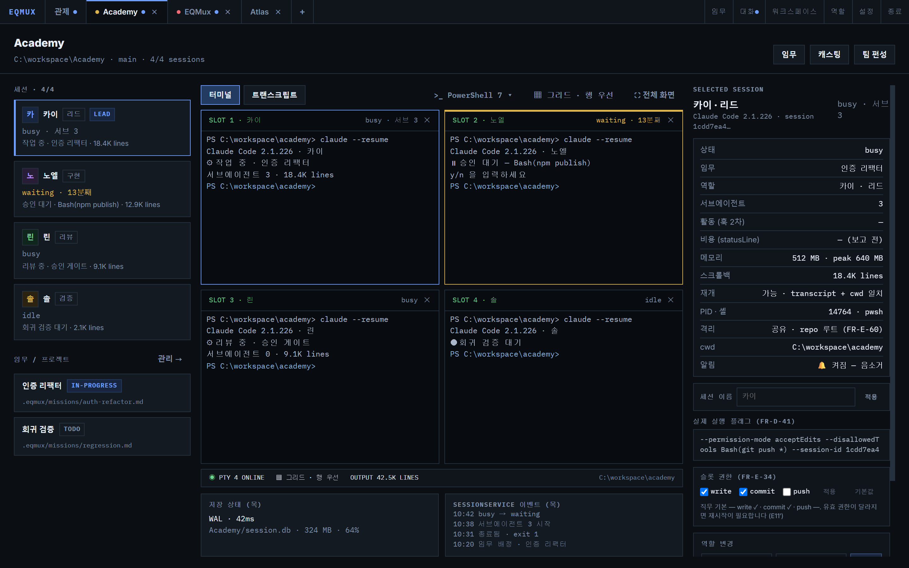
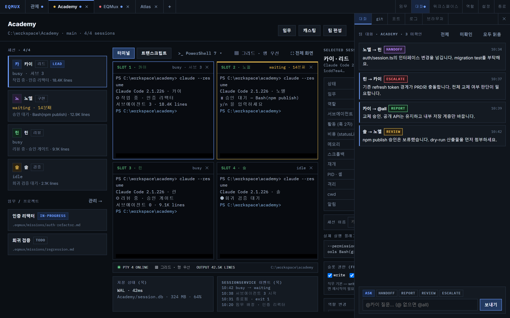
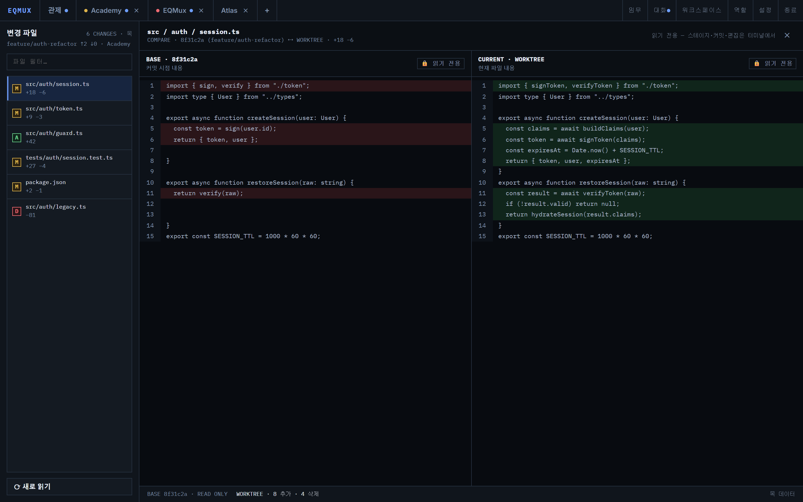
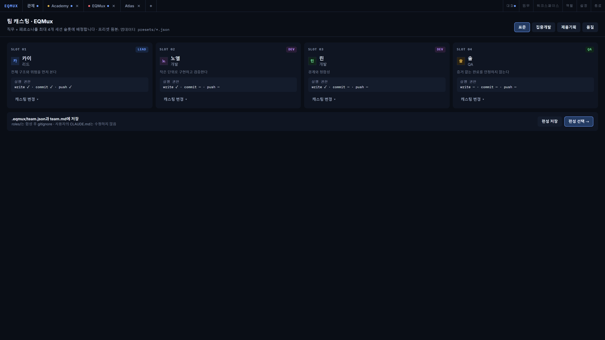

# EQMUX

*[한국어](README.md) · English*

**A desktop app where a team of four AI agents works one git repo together, and a human runs the control tower.**

EQMUX is a Windows desktop app that puts agent-team supervision on top of a terminal multiplexer (MUX).
Each workspace (= 1 git repo = 1 team = 1 tab) runs up to four Claude Code sessions in parallel; you watch
their state from the control dashboard, assign missions, and step in when needed.



## Core principles

- **Supervision is the point.** See team state (busy / waiting / dead) on the dashboard, assign missions, intervene.
- **Four terminals are the workspace.** The actual work is done by the agent CLI (Claude Code) in each pane.
- **The app holds no API key.** It has no AI loop of its own — it only launches an external CLI.
- **Files are the source of truth.** Teams, roles, and missions live as files under `.eqmux/`; the DB is a cache. On conflict, the file wins.
- **There is no automatic execution path.** A user's button is always what changes state. Even after a restart, you get a **resume suggestion** rather than an automatic resume.

## Domain model

```
App  ──────────────── up to 10 workspaces open at once
└─ Workspace ──────── = 1 git repo · 1 team · 1 tab
   ├─ Session 1–4 ─── = 1 agent · 1 terminal pane
   │  └─ Role ─────── = job + persona
   └─ Mission ─────── = a unit of work in the repo (branch + goal)
```

The cap of four sessions is about **legibility**, not resources — at 1920×1080, a 2×2 split is the limit at
which an agent TUI stays readable. Auxiliary panes (editor, diff, browser) do not consume session slots.

## Features

- **Control dashboard** — workspace × session grid, sorted by what needs attention, waiting/dead surfaced first, event feed for state transitions · subagents · missions, OS notifications
- **Terminal workspace** — ConPTY + xterm.js, 6 pane layouts + draggable splitters + zoom, in-terminal search (Ctrl+F), link detection, clipboard and drag-and-drop
- **Agent runtime** — launches Claude Code sessions (`--session-id`, permission flags), state detection via registry watch + hooks, resume and permission restart, degraded-observability indicator
- **Teams · roles · missions** — casting presets, job/persona library (global + per-workspace override), role-file frontmatter decides execution permissions, opt-in git worktree isolation per session
- **Session persistence** — SQLite (WAL) scrollback storage, replays the last 500 lines on restart (SGR colors preserved) with a resume suggestion, FTS full-text search, child process tree cleanup via Job Objects, survives webview crashes
- **Message bus** — typed inter-agent messages (ask / handoff / report / review / escalate), state-aware delivery (immediate when idle, at end of turn when busy), humans join with `@session` and `@all`
- **Dev tool panels** — git (status · worktrees · checkout), explorer (file CRUD), ports, logs, diff viewer, localhost browser
- **Transcript view** — read Claude Code JSONL logs turn by turn (reference only), collapsible tool calls, scrollback fallback
- **External interface** — `eqmux send · report · ping` CLI over a named pipe, statusLine cost collection
- **Settings · themes** — dark/light/system themes, notification routing, replay line count, all persisted to settings.json

## Screens

> Screenshots render the current UI with demo data.

**Workspace** — the four-way terminal split is where work happens. Sessions and missions on the left; the
inspector on the right shows the selected session's state, launch flags, memory, and whether it can resume,
and lets you adjust slot permissions.



**Conversation panel** — inter-agent messages carry an enforced type (ASK / HANDOFF / REPORT / REVIEW /
ESCALATE), and humans join the same stream with `@session` or `@all`. It opens straight from the app bar,
even in terminal fullscreen.



**Git diff & editor** — review agent-authored changes, split between committed state and the worktree.
Read-only by default; staging and committing happen in the terminal.



**Team casting** — assign a job + persona to each of the four slots using a preset (standard / focused build /
review-heavy / exploration). Each slot carries a preview of its execution permissions (write / commit / push).



## Tech stack

| Area | Technology |
|---|---|
| Shell | [Tauri 2](https://tauri.app) — the Rust backend owns PTYs, storage, and agent processes |
| Frontend | [SolidJS](https://solidjs.com) + TypeScript + Vite |
| Terminal | ConPTY ([portable-pty](https://crates.io/crates/portable-pty)) + [xterm.js](https://xtermjs.org) |
| Storage | SQLite (rusqlite, WAL) for sessions · scrollback · events / JSON for settings · layout / files for teams · roles · missions |
| Platform | **Windows first** (WebView2 · Job Objects · NSIS installer) |

## Getting started

### Requirements

- Windows 10/11 (WebView2)
- [Node.js](https://nodejs.org) 18+
- [Rust](https://rustup.rs) (stable)
- [Claude Code CLI](https://claude.com/claude-code) — required to run agent sessions

### Development

```powershell
npm install
npm run tauri dev     # Tauri dev mode (Vite + Rust)
```

### Build

```powershell
npm run tauri build   # produces the NSIS installer (EQMUX_x64-setup.exe)
```

To check only the frontend, run `npm run build` (tsc --noEmit + vite build).

## Project layout

```
├─ src/                  # SolidJS frontend
│  ├─ screens/           # screens (control center · team casting/composition · session detail · settings …)
│  ├─ components/        # app bar · terminal pane · side panels (git/ports/logs/conversation) …
│  └─ backend/           # Tauri invoke wrappers + MockBackend
├─ src-tauri/src/        # Rust backend
│  ├─ ipc.rs, job.rs     # ConPTY spawn · Job Object lifetime management
│  ├─ agent.rs           # Claude Code adapter (launch · state detection · resume · hooks)
│  ├─ store.rs           # SQLite session store (scrollback · events · FTS)
│  ├─ team.rs, roles.rs, missions.rs   # .eqmux file contract
│  └─ cli.rs             # eqmux CLI · named pipe
└─ docs/
   ├─ prd/               # feature PRDs (decision log in 00-index.md)
   ├─ implementation-status.md   # implementation status against the PRDs
   └─ screenshots/       # screen captures
```

## Workspace file contract (`.eqmux/`)

| File | Role |
|---|---|
| `team.json` | source of truth for team composition (committed) |
| `team.md` | derived table that agents read (committed) |
| `roles/<session>.md` | composed per-session role — frontmatter `permissions` decides the execution flags (gitignored) |
| `missions/*.md` | mission definitions (branch + goal) |
| `worktrees/<session>/` | git worktree, when session isolation is opted into |

Your `CLAUDE.md` is never modified — roles are passed as a two-line `--append-system-prompt` pointer.

## Feedback

Bug reports and feature requests are welcome. It's still pre-1.0, so anything helps.

- [English feedback form](https://docs.google.com/forms/d/e/1FAIpQLSdGjEUhbjNoMhi3BiYAeTRnTOPoxqKNKsN4_m0_6Ta_6KcMNw/viewform)
- [한글 문의 폼](https://docs.google.com/forms/d/e/1FAIpQLScn7JEfOpWv1W7FPJwDIFluvRkK_y6_dpOPCe6E-opf-YHHKw/viewform)

## License

MIT — see [LICENSE](LICENSE) for details.
