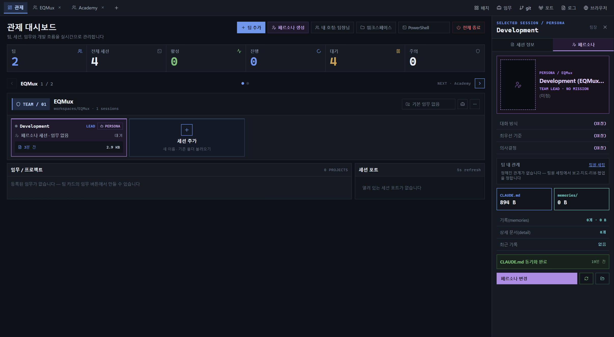
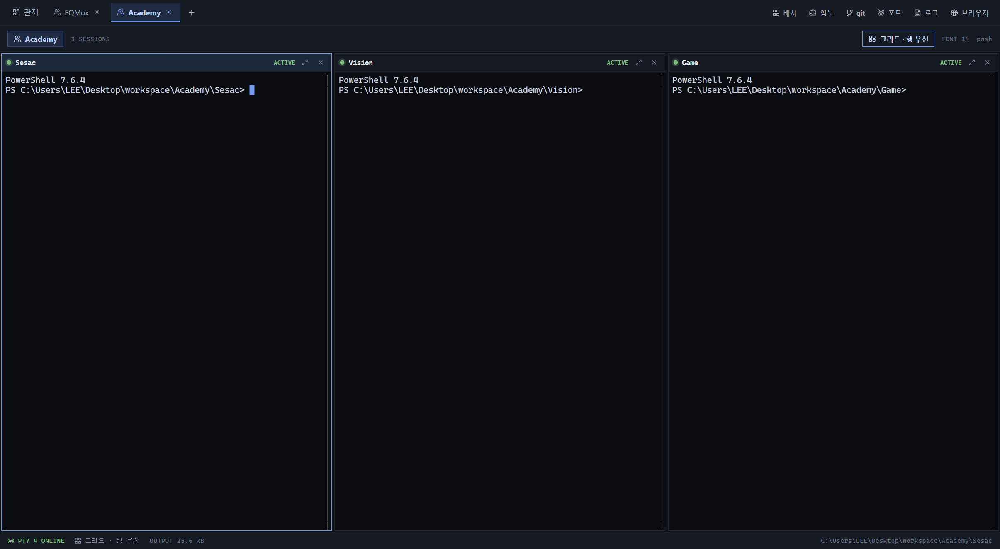

# EQMUX

**하나의 git 저장소를 4명의 AI 에이전트 팀이 함께 작업하고, 사람이 그것을 관제하는 데스크톱 앱.**

EQMUX는 터미널 멀티플렉서(MUX)에 에이전트 팀 관제를 얹은 Windows 데스크톱 앱입니다.
워크스페이스(= git repo 1개 = 팀 1개 = 탭 1개)마다 최대 4개의 Claude Code 세션을 병렬로 띄우고,
관제 대시보드에서 상태를 보고, 임무를 배정하고, 필요할 때 개입합니다.



## 핵심 원칙

- **관제가 핵심이다.** 대시보드에서 팀 상태(busy / waiting / dead)를 보고, 임무를 배정하고, 개입한다.
- **터미널 4개가 작업 공간이다.** 실제 일은 각 페인의 에이전트 CLI(Claude Code)가 한다.
- **앱은 API 키를 보유하지 않는다.** 자체 AI 루프 없이 외부 CLI를 실행할 뿐이다.
- **파일이 원본이다.** 팀·역할·임무의 원본은 `.eqmux/` 아래 파일이고, DB는 캐시다. 불일치 시 파일이 이긴다.
- **자동 실행 경로는 없다.** 상태를 바꾸는 것은 언제나 사용자의 버튼이다. 재시작 후에도 자동 재개 대신 **재개 제안**만 띄운다.

## 도메인 모델

```
앱  ─────────────────── 워크스페이스 최대 10개 동시 오픈
└─ 워크스페이스 ──────── = git repo 1개 = 팀 1개 = 탭 1개
   ├─ 세션 1~4 ───────── = 에이전트 1명 = 터미널 페인 1개
   │  └─ 역할 ────────── = 직무(job) + 페르소나(persona)
   └─ 임무 ───────────── = repo 안의 작업 단위 (브랜치 + 목표)
```

세션 상한 4는 리소스가 아니라 **가독성** 때문입니다(1920×1080 기준 2×2 분할이 에이전트 TUI를 읽을 수 있는 한계).
에디터·diff·브라우저 같은 보조 페인은 세션 슬롯을 소비하지 않습니다.

## 주요 기능

- **관제 대시보드** — 워크스페이스×세션 그리드, 주의 필요 순 정렬, waiting/dead 우선 표시, 상태 전이·서브에이전트·임무 이벤트 피드, OS 알림
- **터미널 워크스페이스** — ConPTY + xterm.js, 페인 배치 6종 + 분할선 드래그 + 줌, 터미널 내 검색(Ctrl+F), 링크 감지, 클립보드·드래그 앤 드롭
- **에이전트 런타임** — Claude Code 세션 기동(`--session-id`·권한 플래그), 레지스트리 watch + 훅 기반 상태 감지, 재개(resume)·권한 재시작, degraded 관측 저하 표시
- **팀·역할·임무** — 편성 프리셋, 직무/페르소나 라이브러리(전역 + 워크스페이스 오버라이드), 역할 파일 frontmatter가 실행 권한을 결정, 세션별 git 워크트리 격리 옵트인
- **세션 영속성** — SQLite(WAL) 스크롤백 저장, 재시작 시 마지막 500줄 재생(SGR 색 보존) + 재개 제안, FTS 전문 검색, Job Object로 자식 프로세스 트리 정리, 웹뷰 크래시 생존
- **메시지 버스** — 에이전트 간 강제 타입 메시지(ask / handoff / report / review / escalate), 상태 기반 전달(유휴면 즉시, 작업 중이면 턴 종료 시), 사람도 `@세션`·`@all`로 참여
- **개발 도구 패널** — git(상태·워크트리·체크아웃)·탐색기(파일 CRUD)·포트·로그·diff 뷰어·localhost 브라우저
- **트랜스크립트 뷰** — Claude Code JSONL 로그를 턴 단위로 열람(참조만), 도구 호출 접기, 스크롤백 폴백
- **외부 인터페이스** — `eqmux send · report · ping` CLI + 명명 파이프, statusLine 비용 수집
- **설정·테마** — 다크/라이트/시스템 테마, 알림 라우팅, 재생 줄 수 등 settings.json 실저장



## 기술 스택

| 영역 | 기술 |
|---|---|
| 셸 | [Tauri 2](https://tauri.app) (Rust 백엔드가 PTY·저장소·에이전트 프로세스를 소유) |
| 프런트엔드 | [SolidJS](https://solidjs.com) + TypeScript + Vite |
| 터미널 | ConPTY ([portable-pty](https://crates.io/crates/portable-pty)) + [xterm.js](https://xtermjs.org) |
| 저장소 | SQLite (rusqlite, WAL) — 세션·스크롤백·이벤트 / JSON — 설정·레이아웃 / 파일 — 팀·역할·임무 |
| 플랫폼 | **Windows 우선** (WebView2 · Job Object · NSIS 인스톨러) |

## 시작하기

### 요구 사항

- Windows 10/11 (WebView2)
- [Node.js](https://nodejs.org) 18+
- [Rust](https://rustup.rs) (stable)
- [Claude Code CLI](https://claude.com/claude-code) — 에이전트 세션 실행에 필요

### 개발

```powershell
npm install
npm run tauri dev     # Tauri 개발 모드 (Vite + Rust)
```

### 빌드

```powershell
npm run tauri build   # NSIS 인스톨러 산출 (EQMUX_x64-setup.exe)
```

프런트엔드만 검사하려면 `npm run build`(tsc --noEmit + vite build).

## 프로젝트 구조

```
├─ src/                  # SolidJS 프런트엔드
│  ├─ screens/           # 화면 (컨트롤 센터 · 팀 캐스팅/편성 · 세션 상세 · 설정 …)
│  ├─ components/        # 앱 바 · 터미널 페인 · 사이드 패널(git/포트/로그/대화) …
│  └─ backend/           # Tauri invoke 래퍼 + MockBackend
├─ src-tauri/src/        # Rust 백엔드
│  ├─ ipc.rs, job.rs     # ConPTY 스폰 · Job Object 수명 관리
│  ├─ agent.rs           # Claude Code 어댑터 (기동·상태 감지·재개·훅)
│  ├─ store.rs           # SQLite 세션 저장소 (스크롤백·이벤트·FTS)
│  ├─ team.rs, roles.rs, missions.rs   # .eqmux 파일 계약
│  └─ cli.rs             # eqmux CLI · 명명 파이프
└─ docs/
   ├─ prd/               # 기능 PRD (결정 대장은 00-index.md)
   ├─ implementation-status.md   # PRD 대조 구현 현황
   └─ screenshots/       # 화면 캡처
```

## 워크스페이스 파일 계약 (`.eqmux/`)

| 파일 | 역할 |
|---|---|
| `team.json` | 팀 편성 원본 (커밋 대상) |
| `team.md` | 에이전트가 읽는 파생 표 (커밋 대상) |
| `roles/<세션>.md` | 세션별 역할 합성 결과 — frontmatter `permissions`가 실행 플래그를 결정 (gitignore) |
| `missions/*.md` | 임무 정의 (브랜치 + 목표) |
| `worktrees/<세션>/` | 세션 격리 옵트인 시 git 워크트리 |

사용자의 `CLAUDE.md`는 수정하지 않습니다 — 역할은 `--append-system-prompt` 포인터 2줄로만 전달됩니다.

## 문서

- [PRD 인덱스 · 결정 대장](docs/prd/00-index.md) — 제품 정의, 11개 PRD 맵, 확정 결정
- [구현 현황](docs/implementation-status.md) — PRD 대조 스냅숏 (M36 기준)
- [화면·흐름 PRD](result_prd.md) — design.pen 기반 화면·내비게이션 계약
- [레퍼런스 비교](docs/features-tree.md) — Ghostty · Orca · bbarit · Terax · AgentCommender 기능 트리

## 라이선스

비공개 (private) — EQMENT Studio.
