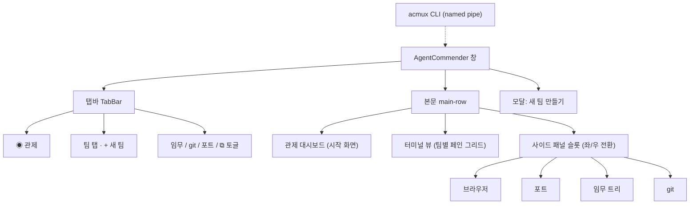

# Feature_Map — AgentCommender 기능 사이트맵

**기준**: 2026-08-01 코드 실측 (`src/`) · 커밋 `c0d23a0` · 빌드·타입체크 통과 상태
**함께 읽을 것**: [Tech_check_List.md](Tech_check_List.md)(구현/미구현 체크) · [README.md](../README.md)(실행·구조)

이 문서는 **"어디에 무엇이 있는가"** 를 트리로 보여준다.
기능의 상세 명세가 아니라 **화면 → 진입점 → 기능 → 코드 위치**의 지도다.

- `▸` 화면·영역 · `•` 기능 · `→` 이동/결과 · `⌨` 단축키
- 각 줄 끝 `— 파일(심볼)`은 그 기능이 사는 코드 위치
- <sub>예정</sub> = UI 자리만 있고 미구현 (§7 참조)

---

## 0. 한 장 요약



앱은 **관제 대시보드로 시작**한다(`App.tsx` `initialState.view='dashboard'`).
터미널 뷰는 항상 렌더링되어 있고 대시보드가 그 위를 덮는 구조 — 전환해도 페인이 리사이즈되지 않는다.

---

## 1. 화면 사이트맵

```
AgentCommender (Electron BrowserWindow · 단일 인스턴스 잠금)
│
├─▸ 탭바 ─────────────────────────────────────────── TabBar.tsx
│   ├─ ◉ 관제          → 대시보드 토글                      ⌨ Ctrl+Shift+H
│   ├─ 팀 탭 ×N        → 팀 전환 · × 또는 휠클릭으로 닫기
│   │   └ 우클릭 메뉴 ┬ 팀원 세팅 (직책 · 관계)  → 편성 팝업 (§3.3)
│   │                 ├ 팀 폴더 열기            → 탐색기
│   │                 └ 팀 닫기
│   ├─ +               → 새 팀 만들기 모달                  ⌨ Ctrl+Shift+T
│   └─ (우측) 임무 · git · 포트 · ⧉    → 사이드 패널 토글    ⌨ ⧉ = Ctrl+Shift+B
│
├─▸ 본문
│   ├─▸ 터미널 뷰 (팀 = 탭, 세션 = 페인)  ······················ §2
│   ├─▸ 관제 대시보드 (위를 덮는 오버레이) ···················· §3
│   ├─  workspace-footer  "추가될 기능들 하나하나 추가할 예정"
│   └─▸ 사이드 패널 슬롯 (한 번에 하나 · 좌/우 배치 전환 · 너비 드래그)
│       ├─▸ 브라우저 ······································· §4.1
│       ├─▸ 포트 ··········································· §4.2
│       ├─▸ 임무 트리 ······································ §4.3
│       └─▸ git ············································ §4.4
│
├─▸ 모달: 새 팀 만들기 (팀 이름 + 팀장 세션 이름) ········· App.tsx(newTeamOpen)
│
└─▸ 외부 제어: acmux CLI ─ named pipe `\\.\pipe\acmux` ···· §5
```

---

## 2. 터미널 뷰

```
▸ 터미널 뷰 ───────────────────────────────── App.tsx · TerminalPane.tsx
│
├─▸ 레이아웃 ─────────────────────────────────────────── model.ts
│   ├─ • 분할 트리 (pane / split{dir,ratio})              — splitPane · removePane
│   │   ├─ ⌨ Ctrl+Shift+D  좌우 분할 (row)
│   │   ├─ ⌨ Ctrl+Shift+E  상하 분할 (col)
│   │   └─ ⌨ Ctrl+Shift+W  활성 페인 닫기 (마지막이면 팀 닫힘)
│   ├─ • 그리드 자동 배치 — 세로 4개 채우고 새 열, 최대 4×2  — buildGrid(MAX_GRID_ROWS=4)
│   ├─ • 팀당 최대 8세션                                   — MAX_TEAM_SESSIONS
│   ├─ • 분할선 드래그로 비율 조절 (0.1~0.9 클램프)         — App.tsx(beginSplitDrag)
│   ├─ • 페인 확대(줌) 토글                     ⌨ Ctrl+Shift+Z
│   └─ • 트리 → 절대좌표(%) 평면 렌더링                     — computeLayout
│        └ 분할해도 기존 터미널이 리마운트되지 않는다(=세션 유지)
│
├─▸ 페인 = 세션 하나 ─────────────────────────────── TerminalPane.tsx
│   ├─ • xterm.js 6 + WebGL 렌더러 (실패 시 기본 렌더러 폴백)
│   ├─ • 스크롤백 10,000줄 · Cascadia Mono · 전용 다크 테마(THEME)
│   ├─ • 터미널 내 검색 바                      ⌨ Ctrl+F   — SearchAddon
│   │    └ Enter 다음 · Shift+Enter 이전 · Esc 닫기
│   ├─ • 복사/붙여넣기 (Windows Terminal 방식)
│   │   ├─ ⌨ Ctrl+C  선택 있으면 복사, 없으면 ^C 인터럽트 전달
│   │   ├─ ⌨ Ctrl+V  스마트 붙여넣기                       — main/index.ts(clipboard:paste)
│   │   │    └ 파일 경로 → 이미지(담당 폴더에 PNG 저장) → 텍스트 순 판별
│   │   └─ 우클릭    선택 있으면 복사, 없으면 붙여넣기
│   ├─ • 드래그&드롭 → 따옴표 감싼 절대경로 입력            — webUtils.getPathForFile
│   ├─ • URL Ctrl+클릭 → 브라우저 패널에서 열기             — WebLinksAddon
│   ├─ • 폰트 크기       ⌨ Ctrl+= / Ctrl+- / Ctrl+0 (8~24, 설정 저장)
│   └─ • 자동 fit + pty resize                             — ResizeObserver
│
└─▸ 팀 전환   ⌨ Ctrl+Tab / Ctrl+Shift+Tab
```

**pty 수명**: 생성 직후 `pause()` → 렌더러가 리스너를 붙인 뒤 `resume()` (초기 출력 유실 방지) — `pty-manager.ts` · `TerminalPane.tsx`

---

## 3. 관제 대시보드

```
▸ 관제 대시보드 ────────────────────────────────────── Dashboard.tsx
│
├─▸ 헤더 액션
│   ├─ • 워크스페이스        → 폴더 선택 다이얼로그, 새 팀/세션부터 적용
│   │                          (ACMUX_WORKSPACE_ROOT 있으면 거부)   — workspace:choose-root
│   ├─ • 기본 셸 select      → PowerShell / pwsh / cmd / Git Bash / WSL  — main/shells.ts
│   ├─ • + 새 팀            → 새 팀 모달 (App.tsx 공용)
│   ├─ • 팀 불러오기        → 워크스페이스 폴더에서 팀 복원          — workspace:list-teams
│   ├─ • ⧉ 브라우저 패널    → 사이드 패널 토글
│   └─ • 전체 종료          → 확인 후 모든 세션 kill
│
├─▸ 통계 타일 — 팀 · 전체 세션 · 활성 · 진행 · 대기
│   └ 상태 판정: 마지막 출력 <3초=활성 · <60초=진행 · 그 외=대기   — activity.ts
│
├─▸ 팀 슬라이더 (한 번에 한 팀) ─── ◀ / 도트 / ▶ · 새 팀 생성 시 자동 이동
│   └─▸ 팀 행
│       ├─ • [팀 배지]      클릭 → 그 팀 터미널로 이동
│       │   └ 우클릭 메뉴 ┬ 폴더로 가기            → 탐색기
│       │                 ├ 팀원 세팅 (직책·관계)  → 편성 팝업 (§3.3)
│       │                 ├ 팀 전체에 명령 보내기 / 일괄 명령
│       │                 └ 팀 종료
│       ├─ • [임무 ▾]      → 임무 드롭다운 (§3.1)
│       ├─ • [기본 칩]      팀 기본 임무 이름 / "기본 임무 없음" · 클릭 → 폴더 열기
│       ├─ • [세션 셀 ×8]   상태점 · 이름 · 상태라벨 · × 종료 · 임무 마커
│       │   ├─ 클릭       → 상세 패널
│       │   ├─ 더블클릭   → 그 터미널로 점프
│       │   └─ 우클릭 메뉴 ┬ 이름 변경          → pty:rename (담당 폴더는 유지)
│       │                  ├ 터미널로 이동
│       │                  ├ 에이전트 실행 ┬ ▶ Claude Code (`claude`)
│       │                  │               ├ ▶ Codex CLI  (`codex`)
│       │                  │               └ ▶ Gemini CLI (`gemini`)
│       │                  └ 세션 종료 (확인)
│       ├─ • [+]           → 팀원 추가 모달 (§3.2)
│       └─ • n/8 카운트 · 남는 자리는 빈 슬롯
│
├─▸ 세션 상세 패널 (셀 클릭 시 우측)
│   ├─ • 상태 · 마지막 출력 시각 · 누적 수신 바이트
│   ├─ • 임무 배정 select (팀 기본 임무는 `(팀 기본)` 표시) + [MISSION.md 열기] · 작업 폴더
│   ├─ • 팀 / 실행 중(셸 또는 에이전트) / 세션 ID / PID / 셸 / 담당 폴더(열기) / 타이틀
│   ├─ • 최근 출력 미리보기 10줄 (ANSI 제거)              — activity.ts(previewOf)
│   ├─ • 페르소나 탭 → 팀 내 관계 ("카이에게 보고" 등) + [팀원 세팅] (§3.3)
│   ├─ • 터미널로 이동 · 세션 종료
│   └─ • 역할(캐릭터) / SKILL / MCP / 기타 관리  <sub>예정</sub>
│
└─▸ 팀이 0개일 때 — 빈 화면 + [새 팀 만들기] [팀 불러오기]
```

### 3.1 임무 드롭다운 (`임무 ▾`)

```
▸ 임무 메뉴 — "<팀> · 진행 중인 임무"                    — project:list
├─ • 임무 행 ×N
│   ├─ 클릭        → 팀 기본 임무로 지정 / 해제 (토글)     — designateProject
│   │                 ├ 지정 시 임무 없는 세션이 자동으로 채워진다 (App의 자동 배정)
│   │                 ├ 다른 임무를 맡은 세션은 유지 · 해제해도 배정은 유지(기본값만 사라짐)
│   │                 └ 지정 성공 → git 패널 자동 오픈 + 그 저장소로 전환
│   ├─ [기본] 태그 · 상태 텍스트(project.json의 status)
│   └─ ⎇ 버튼     → git 연결 모달 (저장소 아니면 init · 주소 주면 origin 등록/갱신)
│                                                        — git.ts(connectProjectGit)
└─ • + 새 임무 만들기 → 임무 생성 모달 (3갈래)
    ├─ git에서 불러오기       url + 이름(선택) → clone      — workspace.ts(cloneProject)
    ├─ 새 프로젝트 만들기     빈 폴더 + project.json        — createProject
    └─ 기존 프로젝트 가져오기 폴더 선택 → junction 연결      — importProject
                              (원본 위치 유지)
```

### 3.1.1 세션 임무 배정 (배정 = 착수)

```
▸ 배정 — 상세 패널 [임무 배정 ▾] · 기본 임무 지정 · 새 세션 자동   — 규격: Mission_Spec.md
├─ 1) 파일에 쓴다 (원본)                                  — main/mission.ts
│   ├─ <세션 폴더>/MISSION.md        임무·경로·목표·산출물·메모
│   │    └ 같은 임무 재배정 = 유지(멱등) · 다른 임무 = 통째 교체 · 해제 = 삭제
│   └─ CLAUDE.md `<!-- mission:start -->` 블록 (~4줄, 페르소나 블록과 공존)
├─ 2) 세션에 알린다 — 무엇을 돌리는지에 따라 갈린다
│   ├─ 셸        → `cd "<임무 폴더>"`
│   └─ 에이전트  → 자연어 브리프 (에이전트 프롬프트의 `cd`는 폴더가 아니라 대화를 바꾼다)
│        └ 판별: SessionInfo.agent — 우클릭 '에이전트 실행'에서 기록 · '셸로 되돌리기'로 해제
└─ 3) 캐시를 갱신한다 — state.json assignments (`"<팀>/<세션>"` → 임무)
     └ 앱 시작 시 MISSION.md 실측으로 대조   — renderer/mission.ts(reconcileMissions)
```

**사라진 임무 정리** (폴더가 앱 밖에서 지워진 경우):

```
▸ 세션 배정   MISSION.md의 Path 폴더 실측(missionOf.missing)
│             └ 시작 시 해제 (MISSION.md 삭제 + 임무 블록 제거)   — reconcileMissions
│             └ 실행 중이면 상세 패널에 경고 + [배정 해제] 버튼 (자동 삭제 안 함)
└▸ 담당(기본) 임무   실측 임무 목록에 없으면 지정 해제 (배정은 유지)
                  ├ 시작 시                      — findDeadTeamProjects
                  ├ 관제에서 그 팀을 볼 때        — Dashboard(teamMissions)
                  ├ 자동 배정이 실패했을 때       — App.tsx(자동 배정 이펙트)
                  └ 담당 칩 클릭 / 임무 우클릭 → 기본 임무 해제
```

### 3.2 대시보드 모달 5종

| 모달 | 진입 | 내용 |
|---|---|---|
| 팀 불러오기 | 헤더 [팀 불러오기] | 워크스페이스 팀 폴더 목록 · 이미 열린 팀은 제외 · 세션 폴더 이름 그대로 복원(최대 8) |
| 팀원 추가 | 팀 행 `+` | 기존 세션 폴더 클릭 = 그 폴더 이어받기 / 새 이름 입력 = 새 폴더 |
| 세션 이름 변경 | 세션 우클릭 | 실행 중 중복 이름 거부 · 담당 폴더는 그대로 |
| 새 임무 만들기 | 임무 메뉴 | 3갈래(§3.1) |
| git 연결 | 임무 행 `⎇` | 원격 주소 입력(선택) · 비우면 init만 |

### 3.3 팀원 세팅 (직책 · 관계)

```
▸ 팀원 세팅 팝업 — 팀 탭 우클릭 / 팀 메뉴 / 페르소나 탭   — 규격: Team_Spec.md
│                                    — TeamRosterDialog.tsx · main/team.ts · renderer/team.ts
├─▸ 관계도 (SVG) — 보고선으로 층 배치(위가 상급), 한 층 5명 이상이면 아래 줄로
│   └ 보고(파랑 실선) · 지도(보라 파선) · 리뷰(청록 점선) · 협업(초록) + 화살표
├─▸ 팀원 · 직책 — 자유 입력(프리셋 자동완성) · LEAD 뱃지 · 부여된 인격 이름 · 미실행 표기
├─▸ 관계 — [앞] [종류] [뒤] [메모] 행 추가/삭제 (자기 자신·중복은 저장 때 빠짐)
├─ • 기본 편성 채우기 — 빈 직책만 팀장/팀원, 없는 보고선만 팀장에게
└─ • 저장 → 1) <팀>/team.json (원본)  2) <팀>/TEAM.md (편성표)
              3) 팀원 CLAUDE.md `<!-- team:start -->` 블록 (자기 관계만 · 있는 파일만)
```

---

## 4. 사이드 패널 (4종 · 한 번에 하나)

공통: 좌/우 배치 전환 토글(`PanelSideToggle.tsx`) · 경계 드래그로 너비 조절(280px~) · 배치는 설정에 저장

### 4.1 브라우저 — `BrowserPanel.tsx` + `main/browser-panel.ts`

```
▸ 브라우저 패널   ⌨ Ctrl+Shift+B
├─ • 툴바: ◀ 뒤로 · ▶ 앞으로 · ⟳ 새로고침 · URL/검색 입력 · 좌우토글 · ✕
├─ • 주소 추론 — 스킴 없으면 도메인꼴은 https://, 아니면 Google 검색
├─ • 구현: iframe이 아니라 main 프로세스 WebContentsView (X-Frame-Options 무관)
│    └ 렌더러는 placeholder 좌표만 IPC로 동기화
├─ • 새 창 요청은 같은 패널에서 연다 (setWindowOpenHandler → deny + loadURL)
└─ • 진입 경로: 탭바 ⧉ · 터미널 URL Ctrl+클릭 · 포트 패널 [열기] · 팀 우클릭 git 주소
```

### 4.2 포트 — `PortsPanel.tsx` + `main/ports.ts`

```
▸ 사용 중인 포트 (LISTENING) · 5초 자동 갱신
├─ • 검색 — 포트 · 프로세스 · PID · 세션 이름
├─▸ 세션 포트  (터미널 세션이 띄운 서버)
│   ├─ 판별: netstat 소유 pid → 부모 추적(최대 64단계) → 세션 셸 pid 매칭
│   ├─ [열기] → 브라우저 패널로 http://localhost:<포트>
│   └─ [끄기] → 확인 후 taskkill /T /F (프로세스 트리 종료)
└─▸ 시스템 포트 (기본 접힘 · 검색 중엔 자동 펼침)
    └ 포트 · 프로세스 · PID · 주소 (조작 없음)
```

### 4.3 임무 트리 — `MissionsPanel.tsx`

```
▸ 팀별 임무
├─ • 검색 — 팀 · 임무 이름 (검색 중엔 팀 자동 펼침)
└─▸ 팀 → 임무 → 폴더 (지연 로딩, 한 번에 500개까지)
    ├─ 클릭     → 펼치기/접기
    └─ 더블클릭 → 탐색기로 열기
    └ 가드: 워크스페이스 루트 밖은 열람 거부       — workspace.ts(listProjectDir)
```

### 4.4 git — `GitPanel.tsx` + `main/git.ts`

```
▸ git 패널
│
├─▸ 저장소 선택 (팀별 optgroup)                    — git.ts(listGitRepos)
│   ├─ 탐색 범위: 팀 폴더 → 세션 폴더 → 세션 하위 1단계 + 임무 폴더
│   └─ 마지막 선택 기억 (localStorage `acmux-git-repo`)
│
├─▸ 툴바
│   ├─ • 브랜치 select — 로컬/원격 optgroup · detached 표기
│   │    └ 원격 선택 → 로컬 추적 브랜치로 checkout (있으면 그 로컬로)
│   ├─ • ↑ahead ↓behind / "업스트림 없음"
│   ├─ • [diff]   → 작업 트리 diff 팝업
│   ├─ • [↓ pull]  (원격 없으면 비활성)
│   ├─ • [commit N] → 커밋 팝업
│   └─ • [↑ push]  (업스트림 없으면 `-u origin HEAD` 자동 재시도)
│
├─▸ 커밋 그래프 (본문)                             — buildGraph · GraphCell
│   ├─ • `log --all --topo-order` 최대 200개 · SVG 레인 배치(최대 12레인)
│   ├─ • 브랜치·머지 곡선 · 레인별 8색 순환
│   ├─ • refs 배지 — HEAD / 원격 / 태그
│   ├─ • 제목 · 작성자 · 상대시간 · 짧은 해시
│   └─ • 행 클릭 → 그 커밋의 diff 팝업
│
├─▸ diff 팝업 (3분할)                        — repoDiffFiles · repoFileDiff
│   ├─ 왼쪽   변경 파일 폴더 트리 (M/A/D/R/C/U 색상 코드)
│   ├─ 가운데 비교 대상 — HEAD(작업 트리 모드) / 부모 커밋(커밋 모드) · 삭제 줄 빨강
│   ├─ 오른쪽 현재 — 작업 트리 / 그 커밋 · 추가 줄 초록
│   └─ 줄 번호 · 바이너리 안내 · 대용량 클리핑(파일 300KB · 패널 4000줄)
│
├─▸ 커밋 팝업
│   ├─ • 변경 파일 체크박스 (전체 선택 · 상태 코드 색상)
│   ├─ • 전체 선택 시 `add -A` 커밋, 일부면 그 경로만 (rename은 양쪽 경로 모두)
│   └─ • 메시지 입력 · Ctrl+Enter 커밋
│
├─▸ 자동 갱신 — status 5초 폴링, 브랜치/ahead/behind/변경 수가 바뀌면 그래프·브랜치 재조회
│
└─▸ 안전 가드
    ├─ 워크스페이스 밖 저장소 차단                 — main/index.ts(repoInWorkspace)
    ├─ 저장소 밖 파일 경로 차단                    — git.ts(repoFileDiff)
    ├─ 커밋 해시 형식 검사 · `-`로 시작하는 ref 거부
    └─ `GIT_TERMINAL_PROMPT=0`(자격증명 프롬프트로 멈추지 않음) · `GIT_OPTIONAL_LOCKS=0`
```

---

## 5. 외부 제어 — acmux CLI

```
▸ acmux (named pipe `\\.\pipe\acmux` · JSON 한 줄 왕복)
│                                    — cli/acmux.ts · main/control-server.ts
├─ • list                        세션 목록 (id · 이름 · 팀 · pid · cwd)
├─ • new [--name <이름>]          새 팀
├─ • add [팀이름|번호] [--name]   팀에 세션 추가 (그리드 재배치)
├─ • split [row|col]             활성 페인 분할
├─ • send <id|이름> <텍스트>      세션에 입력 (기본 Enter 포함 · --no-enter)
├─ • kill <id|이름>               세션 종료
├─ • browser <url>               브라우저 패널 열고 이동
├─ • dashboard                   관제 대시보드 열기
└─ • screenshot <파일.png>        창 캡처 (+ 브라우저 패널은 `*.browser.png`)
```

세션 타겟은 **id 또는 이름** 둘 다 받는다(`PtyManager.resolve`).
`new`/`add`/`split`/`browser`/`dashboard`는 렌더러에 `ui:command`로 전달된다.

---

## 6. 데이터 · 저장 위치

```
▸ 상태 파일
│   %USERPROFILE%\AgentCommender\state.json         (ACMUX_STATE_PATH로 재지정)
│   ├─ teams[]        팀 이름 + 레이아웃 트리 + 페인별 세션 이름
│   ├─ assignments    "<팀>/<세션>" → 배정 임무 (화면용 캐시 · 원본은 MISSION.md)
│   ├─ teamProjects   팀 이름 → 기본 임무
│   └─ settings       fontSize · shell · panelSide · workspaceRoot
│   └ 500ms 디바운스 저장 · tmp → rename 원자적 쓰기 · 메인 전용 설정 병합 보존
│
▸ 워크스페이스 루트    ACMUX_WORKSPACE_ROOT > 첫 실행 선택 > ~/AgentCommender/workspaces
│   └─ <팀>/
│       ├─ team.json               팀 편성 원본 (직책·관계)      ┐ 팀원 세팅에서 생성
│       ├─ TEAM.md                 팀 편성표 (team.json 파생)    ┘ — Team_Spec.md
│       ├─ <세션>/                 세션 담당 폴더 (자동 생성)
│       │   ├─ ROLE.md             역할 정의 + 폴더 규약   ┐ 없는 파일만 생성
│       │   ├─ CLAUDE.md           세션 지침 + 임무·페르소나·팀 블록 ┘ (미덮어쓰기)
│       │   ├─ MISSION.md          임무 브리프 (배정 시 생성 · 해제 시 삭제)
│       │   ├─ session.log         출력 로그 (ANSI 제거)
│       │   └─ session.log.old     5MB 초과 시 회전
│       └─ project/<임무>/
│           └─ project.json        name · team · status · createdAt · source
│
▸ 브라우저 로컬 저장    localStorage `acmux-git-repo` (git 패널 마지막 저장소)
│
▸ 환경변수 오버라이드   ACMUX_WORKSPACE_ROOT · ACMUX_STATE_PATH · ACMUX_SHELL
```

**세션 이름 규칙**: 지정 없으면 `s<N>` · 중복이면 `-2`, `-3`… 접미사 (담당 폴더 충돌 방지)
**팀 이름 규칙**: 생성 시 한 번만 지정, 이후 변경 불가 · 중복 거부 (같은 이름 = 같은 담당 폴더)

---

## 7. 단축키 전체

| 범위 | 키 | 동작 |
|---|---|---|
| 앱 | `Ctrl+Shift+T` | 새 팀 모달 |
| 앱 | `Ctrl+Shift+W` | 활성 페인 닫기 (마지막이면 팀 닫힘) |
| 앱 | `Ctrl+Shift+D` / `Ctrl+Shift+E` | 좌우 분할 / 상하 분할 |
| 앱 | `Ctrl+Tab` / `Ctrl+Shift+Tab` | 다음 팀 / 이전 팀 |
| 앱 | `Ctrl+Shift+H` | 관제 대시보드 토글 |
| 앱 | `Ctrl+Shift+B` | 브라우저 패널 토글 |
| 앱 | `Ctrl+Shift+Z` | 페인 확대(줌) 토글 |
| 앱 | `Ctrl+=` / `Ctrl+-` / `Ctrl+0` | 폰트 크기 증가 / 감소 / 리셋 |
| 터미널 | `Ctrl+C` | 선택 있으면 복사, 없으면 ^C |
| 터미널 | `Ctrl+V` | 스마트 붙여넣기 |
| 터미널 | `Ctrl+F` | 검색 바 |
| 터미널 | 우클릭 | 선택 복사 / 붙여넣기 |
| 창 | `F12` / `Ctrl+Shift+R` | 개발자 도구 / 새로고침 |

전역 단축키는 `shortcuts.ts`의 `shortcutOf` 하나로 정의되고, xterm이 삼키지 않도록
`attachCustomKeyEventHandler`에서도 같은 함수를 쓴다.

---

## 8. 예정 슬롯 (UI 자리만 있음)

| 위치 | 항목 |
|---|---|
| 세션 상세 패널 | 세션의 역할(캐릭터) · 설치된 SKILL · 설치된 MCP · 기타 관리 |
| 터미널 뷰 하단 | workspace-footer — "추가될 기능들 하나하나 추가할 예정" |

미구현 로드맵 전체는 [Tech_check_List.md](Tech_check_List.md) "다음 작업 리스트" 참조
(로드맵 3축 · bbarit 터미널 흡수 · Orca 흡수 · Cockpit 이식 4갈래).

---

## 9. 기능 → 코드 역인덱스

| 기능 영역 | 렌더러 | 메인 | IPC 채널 |
|---|---|---|---|
| 탭·분할·상태머신 | `App.tsx` · `model.ts` | — | — |
| 터미널 페인 | `TerminalPane.tsx` | `pty-manager.ts` | `pty:*` |
| 관제 대시보드 | `Dashboard.tsx` · `activity.ts` | — | `pty:list` |
| 팀·세션 폴더 | — | `workspace.ts` | `workspace:*` |
| 임무(프로젝트) | `MissionsPanel.tsx` | `workspace.ts` | `project:*` |
| 임무 배정 | `Dashboard.tsx` · `renderer/mission.ts` | `main/mission.ts` | `mission:*` · `pty:set-agent` |
| 팀 편성(직책·관계) | `TeamRosterDialog.tsx` · `renderer/team.ts` | `main/team.ts` | `team:roster` · `team:save-roster` |
| git | `GitPanel.tsx` | `git.ts` | `git:*` |
| 포트 | `PortsPanel.tsx` | `ports.ts` | `ports:*` |
| 브라우저 | `BrowserPanel.tsx` | `browser-panel.ts` | `browser:*` |
| 셸 감지 | — | `shells.ts` | `shells:list` |
| 상태 저장 | `App.tsx` | `state.ts` | `state:load` · `state:save` |
| CLI 제어 | `App.tsx(onUiCommand)` | `control-server.ts` · `cli/acmux.ts` | `ui:command` |

전체 IPC 표면은 `src/preload/index.ts`의 `api` 객체 하나에 모여 있다 (`window.acmux`).
