# EQMUX 문서

> 버전 0.2.0 · Windows 10/11
>
> 화면 캡처는 데모 데이터로 렌더링한 것입니다.

## 목차

1. [EQMUX란](#eqmux란)
2. [설치](#설치)
3. [시작하기](#시작하기)
4. [핵심 개념](#핵심-개념)
5. [화면 안내](#화면-안내)
6. [팀 만들기](#팀-만들기)
7. [임무](#임무)
8. [에이전트 세션](#에이전트-세션)
9. [대화](#대화)
10. [코드 검토](#코드-검토)
11. [영속성과 복구](#영속성과-복구)
12. [설정](#설정)
13. [단축키](#단축키)
14. [eqmux CLI](#eqmux-cli)
15. [파일 구조](#파일-구조)
16. [문제 해결](#문제-해결)
17. [설계 경계](#설계-경계)

---

## EQMUX란

**하나의 git 저장소를 AI 에이전트 팀이 함께 작업하고, 사람이 그것을 관제하는 데스크톱 앱입니다.**

터미널 멀티플렉서(여러 터미널을 한 창에서 다루는 도구)에 에이전트 팀 관제를 얹었습니다. 저장소마다 여러 개의 에이전트 세션을 병렬로 띄우고, 관제 대시보드에서 상태를 보고, 임무를 배정하고, 필요할 때 개입합니다.

EQMUX가 하는 일과 하지 않는 일이 뚜렷합니다.

- **하는 일** — 터미널을 띄우고, 에이전트 상태를 관측하고, 역할과 임무를 파일로 관리하고, 결과를 검토할 도구를 제공합니다.
- **하지 않는 일** — 스스로 AI를 호출하지 않습니다. API 키를 갖지 않습니다. 사용자 대신 승인하거나 커밋하지 않습니다. 자세한 내용은 [설계 경계](#설계-경계)를 보세요.

---

## 설치

### 요구 사항

| 항목 | 내용 |
|---|---|
| 운영체제 | Windows 10 / 11 (WebView2 런타임) |
| 에이전트 CLI | [Claude Code](https://claude.com/claude-code) — 에이전트 세션 기능에 필요. 설치하고 로그인해 두세요 |
| git | 저장소 연결 · 워크트리 · diff 기능에 필요 |

EQMUX 자체는 API 키를 요구하지 않습니다. 에이전트 인증은 CLI가 담당합니다.

### 설치하기

인스톨러 `EQMUX_<버전>_x64-setup.exe`를 실행합니다. 현재 사용자 모드로 설치되어 **관리자 권한이 필요 없습니다**. 설치 언어는 한국어와 영어를 지원합니다.

설치 폴더의 `eqmux.exe`는 앱이자 곧 CLI입니다 — 별도로 설치할 것이 없습니다. 앱이 띄우는 터미널에는 이 폴더가 `PATH` 앞에 붙으므로 어디서든 `eqmux` 명령을 쓸 수 있습니다.

### 소스에서 빌드

```powershell
npm install
npm run tauri dev      # 개발 모드
npm run tauri build    # NSIS 인스톨러 생성
```

Node.js 18+ 와 Rust(stable)가 필요합니다.

---

## 시작하기

앱을 처음 켜면 관제 대시보드가 열립니다. 아직 저장소가 없으니 연결부터 합니다. 온보딩은 네 단계입니다 — **저장소 연결 → 실행 방식 → 세션 구성 → 시작**.

### 1단계 · 저장소 연결

앱 바의 **워크스페이스** 버튼(또는 탭바의 `+`)을 눌러 연결 화면을 엽니다.

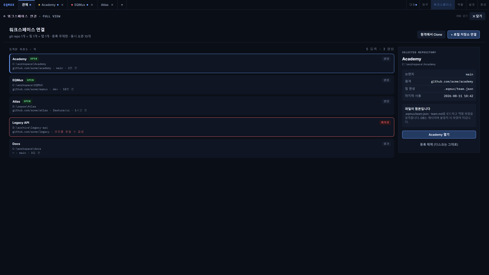

- **로컬 저장소 연결** — 이미 있는 git 저장소 폴더를 고릅니다
- **원격에서 Clone** — 원격 주소로 새로 받아옵니다

등록은 무제한이고, 동시에 열 수 있는 워크스페이스는 10개입니다. 저장소를 옮겼다면 `재지정`으로 경로만 다시 잡아주면 됩니다. `등록 해제`는 목록에서만 지우고 **디스크의 파일은 건드리지 않습니다.**

### 2단계 · 실행 방식 고르기

저장소를 열면 첫 세션을 어떻게 시작할지 묻습니다.

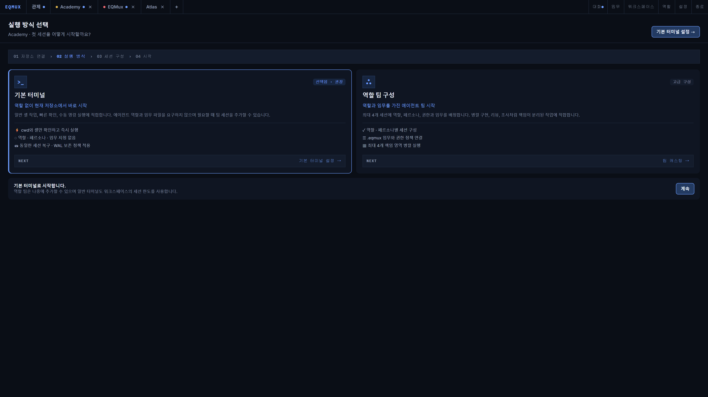

| 선택 | 언제 |
|---|---|
| **기본 터미널** (권장) | 일반 셸 작업, 빠른 확인, 수동 명령 실행. 역할·페르소나·임무 없이 바로 시작합니다 |
| **역할 팀 구성** (고급) | 병렬 구현·리뷰·조사처럼 책임이 분리된 작업. 슬롯마다 역할과 권한, 임무를 배정합니다 |

기본 터미널로 시작해도 나중에 언제든 역할을 부여할 수 있습니다.

### 3단계 · 팀 캐스팅 (역할 팀을 골랐다면)

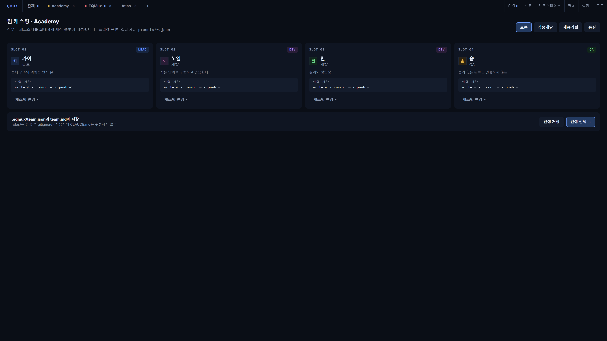

편성 프리셋을 고르면 슬롯이 자동으로 채워집니다. 슬롯마다 **직무 + 페르소나**가 배정되고, 아래에 실행 권한(`write` / `commit` / `push`)이 미리 보입니다.

`편성 선택 →`을 누르면 `.eqmux/team.json`과 `team.md`가 저장되고 세션이 만들어집니다.

### 4단계 · 에이전트 띄우기

**중요: 세션은 모두 일반 셸로 시작합니다.** 캐스팅을 해도 앱이 에이전트를 자동으로 실행하지 않습니다.

터미널 페인에서 직접 실행하세요.

```powershell
claude
```

그러면 관제 대시보드가 프로세스 트리를 스캔해 감지하고, 세션 셀에 `Claude` 배지를 붙입니다. 이때부터 상태(`busy` · `waiting` · `idle`)가 실시간으로 갱신됩니다.

> **왜 자동으로 안 띄우나요?** 상태를 바꾸는 것은 언제나 사용자의 버튼이라는 원칙 때문입니다. 재시작 후에도 마찬가지로 자동 재개 대신 제안 카드를 띄웁니다.

### 5단계 · 임무 배정

앱 바의 **임무** 버튼에서 임무를 만들고 세션에 배정합니다. 배정하면 그 세션의 역할 파일에 임무가 기록되고, 살아 있는 에이전트에게는 한 줄 브리프가 전달됩니다.

---

## 핵심 개념

```
앱  ─────────────────── 워크스페이스 최대 10개 동시 오픈
└─ 워크스페이스 ──────── = git repo 1개 = 팀 1개 = 탭 1개
   ├─ 세션 1~N ───────── = 에이전트 1명 = 터미널 페인 1개
   │  └─ 역할 ────────── = 직무(job) + 페르소나(persona)
   └─ 임무 ───────────── = repo 안의 작업 단위 (브랜치 + 목표)
```

| 용어 | 뜻 |
|---|---|
| **워크스페이스** | git 저장소 하나 = 팀 하나 = 탭 하나. 이 1:1:1 덕분에 git·탐색기·diff·검색의 범위가 하나로 통일됩니다 |
| **세션** | 터미널 페인 하나 = 에이전트 한 명. 기본 4개, 설정에서 6·8개까지 |
| **보조 페인** | 에디터 · diff · 브라우저 · 트랜스크립트. 세션 슬롯을 쓰지 않습니다 |
| **패널** | 사이드 도구 서랍(개요·git·포트·로그·브라우저). 페인이 아니라 분할 그리드 밖에 있습니다 |
| **직무** | 책임과 권한. 고정 8종 |
| **페르소나** | 판단 성향. 직무와 분리되어 있습니다 |
| **임무** | 브랜치 + 목표 + 산출물. `.eqmux/missions/*.md` 파일이 원본 |

**세션이 기본 4개인 이유**는 리소스가 아니라 가독성입니다. 1920×1080에서 2×2 분할이 에이전트 TUI를 읽을 수 있는 한계입니다(8분할이면 페인당 14행). 설정에서 늘릴 수 있고, 줄여도 이미 열린 세션은 닫히지 않습니다.

**파일이 원본입니다.** 팀·역할·임무는 `.eqmux/` 아래 파일이 원본이고 데이터베이스는 캐시일 뿐입니다. 에이전트나 외부 편집기가 파일을 바꾸면 앱이 감지해 따라갑니다.

---

## 화면 안내

### 탭바

맨 왼쪽이 **관제 고정 탭**, 그 뒤로 워크스페이스 탭이 붙습니다. `Ctrl+Shift+D`로 관제와 직전 워크스페이스를 오갑니다.

### 앱 바 전역 도구

오른쪽 위 버튼들은 어디서든(터미널 전체 화면에서도) 열립니다.

| 버튼 | 여는 것 |
|---|---|
| 대화 | 사이드 패널 (개요 탭) |
| 임무 | 임무 · 파일 탐색기 (전체 화면) |
| 워크스페이스 | 저장소 연결 (전체 화면) |
| 역할 | 역할 라이브러리 (전체 화면) |
| 설정 | 설정 (전체 화면) |

전체 화면 팝업은 한 번에 하나만 열리고 `ESC`로 닫힙니다.

### 워크스페이스 화면

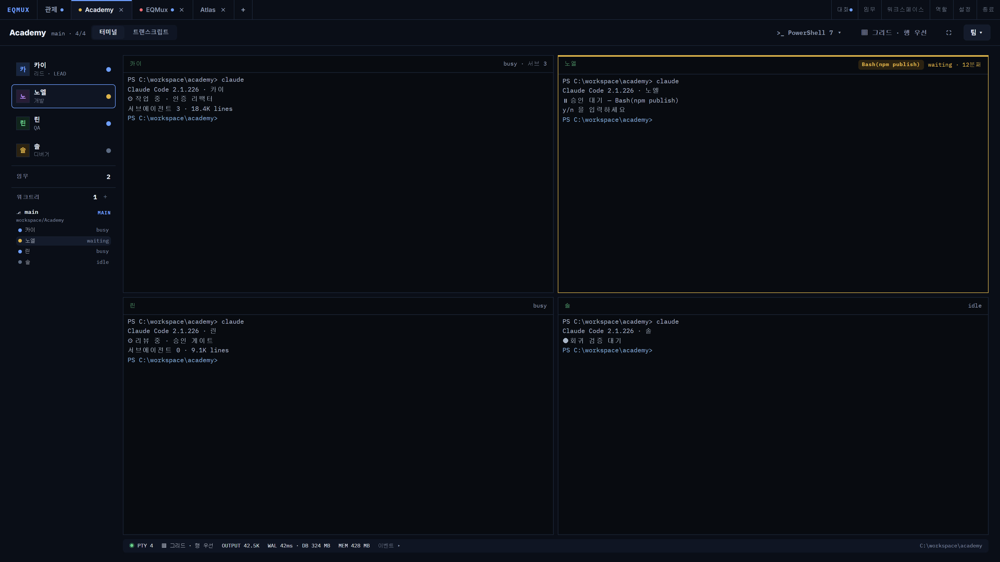

- **왼쪽 레일** — 세션 목록(클릭=포커스, ⓘ=상세, 우클릭=메뉴) · 임무 수 · 워크트리 섹션
- **가운데** — 터미널 그리드 또는 트랜스크립트
- **아래 상태 바** — PTY 수 · 배치 · 출력량 · WAL 지연 · DB 크기 · 메모리 · 이벤트

### 사이드 패널

| 탭 | 내용 |
|---|---|
| **개요** | 에이전트 간 대화 스트림 |
| **git** | 브랜치 · 커밋 · 워크트리 · diff 진입 |
| **포트** | 세션이 연 포트와 시스템 포트 |
| **로그** | 이벤트 원장 스트림 + 전문 검색 |
| **브라우저** | localhost 미리보기 |

패널은 좌/우 어느 쪽에도 붙일 수 있고, 위치는 저장됩니다.

---

## 팀 만들기

### 직무 (고정 8종)

직무는 **책임**입니다. 로스터는 8종으로 고정되어 있고 추가·삭제 없이 편집만 가능합니다.

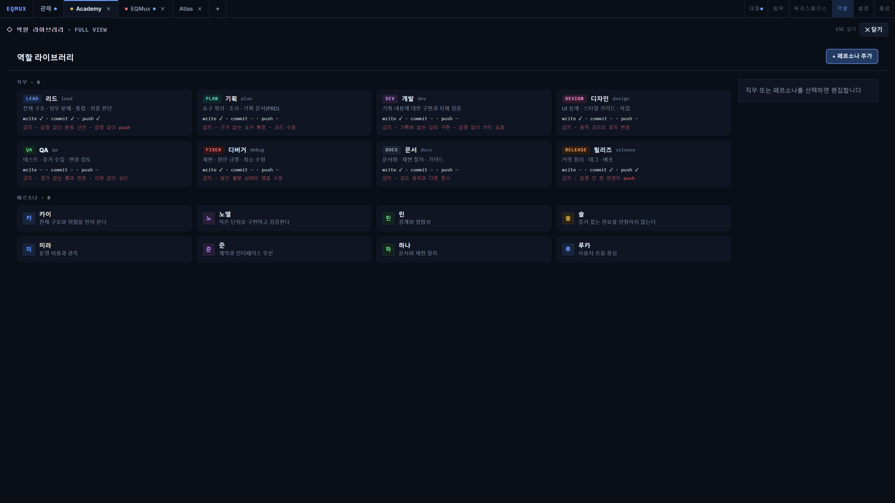

| 직무 | 책임 | write | commit | push |
|---|---|:---:|:---:|:---:|
| 리드 | 전체 구조 · 임무 분해 · 통합 · 최종 판단 | ✓ | ✓ | ✓ |
| 기획 | 요구 정리 · 조사 · 기획 문서 | ✓ | — | — |
| 개발 | 구현과 자체 검증 | ✓ | — | — |
| 디자인 | UI 설계 · 스타일 가이드 · 목업 | ✓ | — | — |
| QA | 테스트 · 증거 수집 · 변경 검토 | — | — | — |
| 디버거 | 재현 · 원인 규명 · 최소 수정 | ✓ | — | — |
| 문서 | 문서화 · 재현 절차 · 가이드 | ✓ | — | — |
| 릴리즈 | 커밋 정리 · 태그 · 배포 | — | ✓ | ✓ |

각 직무에는 **금지 사항**도 함께 정의되어 있습니다(예: QA는 "증거 없는 통과 판정 금지").

### 페르소나 (3단계)

페르소나는 **판단 성향**입니다. 프롬프트 예산은 5~10줄이고 초과하면 경고합니다.

| 레벨 | 담기는 것 |
|---|---|
| **기본** | 판단 힌트 한 줄 |
| **중간** | 판단 힌트 + 말투 + 성격 (각 3줄 예산, 말투 프리셋 제공) |
| **고급** | 캐릭터 시트 파일(`personas/<id>.character.md`). 역할 파일에는 정체성 한 줄과 경로만 들어갑니다 |

레벨을 바꿔도 값이 섞이지 않고, 낮은 레벨로 내려도 디스크의 내용은 보존됩니다.

### 캐스팅과 권한

편성 프리셋 4종으로 시작할 수 있습니다.

| 프리셋 | 구성 |
|---|---|
| 표준 | 리드 · 개발 2 · QA |
| 집중개발 | 개발 중심 |
| 제품기획 | 리드 · 기획 · 디자인 · 개발 |
| 품질 | 개발 · 디버거 · QA · 문서 |

**권한 바꾸기** — 세션 상세 패널에서 직무 기본 권한을 세션 단위로 덮어쓸 수 있습니다. 다만 실행 권한은 프로세스 수명 동안 고정이라, 권한을 바꾸면 **재시작 배지**가 뜨고 재개 기반 재시작으로 반영됩니다(대화는 유지됩니다).

**관계 보기** — 팀 편성 화면에서 보고·지도·리뷰·협업 관계를 그림으로 확인합니다.

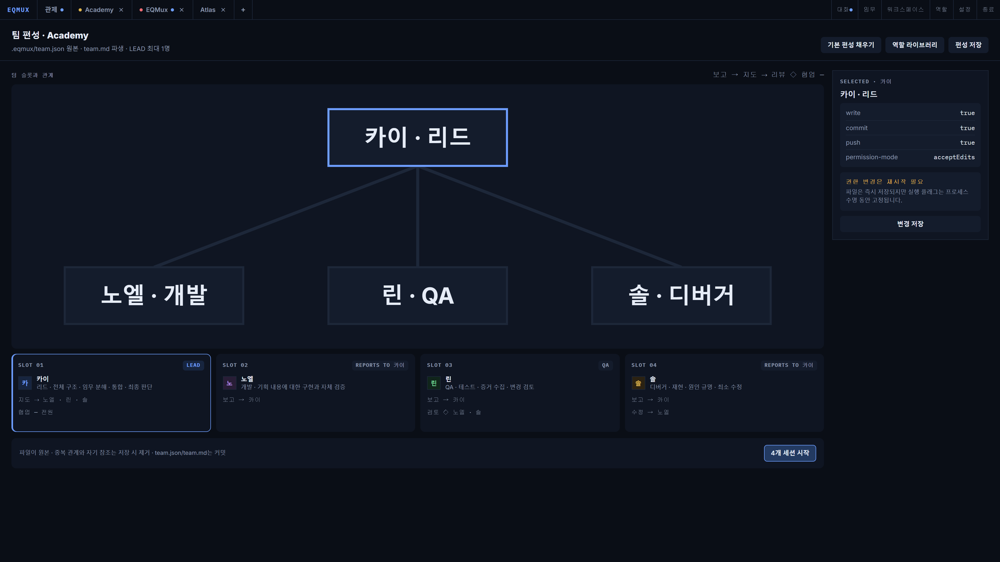

---

## 임무

임무는 `.eqmux/missions/<슬러그>.md` 파일이 원본입니다.

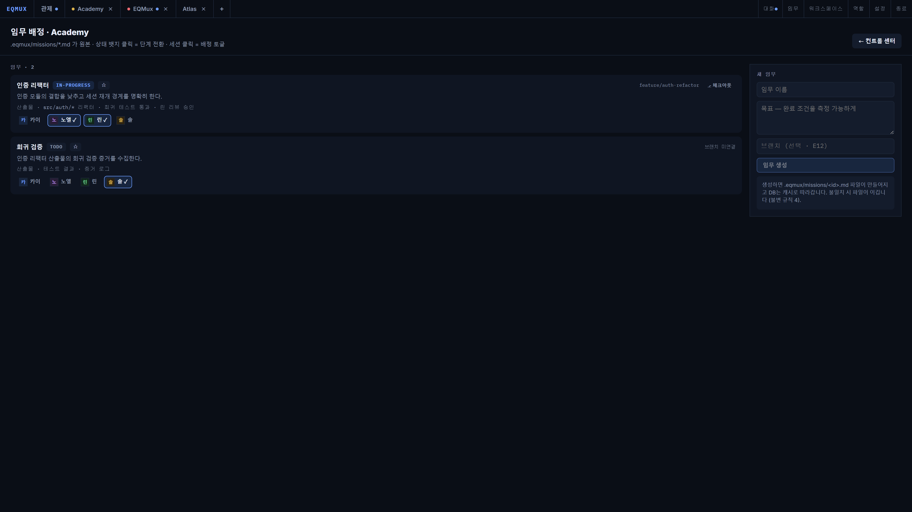

### 임무 만들기

임무 화면 오른쪽에서 이름 · 목표 · 브랜치(선택)를 넣고 생성합니다. 목표는 **완료 조건을 측정 가능하게** 쓰는 것이 좋습니다.

### 배정

임무 카드의 세션 칩을 클릭하면 배정/해제가 토글됩니다. 배정하면

1. 그 세션의 역할 파일에 임무 블록이 삽입되고
2. 살아 있는 에이전트에게 자연어 브리프 한 줄이 전달됩니다

### 상태와 브랜치

- 상태 뱃지를 클릭하면 `todo → in-progress → in-review → done` 순으로 돕니다. 본문은 그대로 보존되고 frontmatter만 갱신됩니다.
- `⎇ 체크아웃`으로 임무 브랜치로 전환합니다. 공유 저장소 전체에 영향을 주므로 2단 확인을 거칩니다.
- ★ 뱃지로 **기본 임무**를 지정하면(워크스페이스당 1개), 임무 없는 새 역할 세션이 만들어질 때 자동으로 배정받습니다.

### 임무 · 파일 탐색기

앱 바 **임무** 버튼으로 열리는 전체 화면 팝업입니다. 왼쪽은 파일 트리, 오른쪽은 미리보기 — 임무 파일은 구조화되어 보입니다.

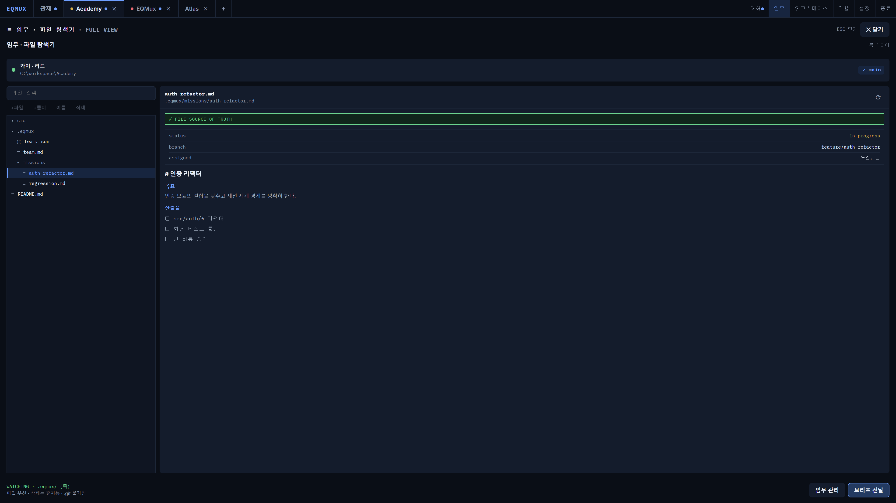

파일 생성 · 이름 변경 · 삭제(휴지통) · 편집 저장이 모두 가능합니다. `.git` 폴더는 불가침이고, 삭제는 영구 삭제가 아니라 휴지통으로 갑니다.

---

## 에이전트 세션

### 셸 우선 모델

모든 세션은 일반 셸로 시작합니다. 에이전트 실행은 언제나 사용자의 명시적 행동입니다.

- 터미널에서 직접 `claude` 실행 → 대시보드가 감지해 배지 표시
- 페인의 재개 카드 · 세션 상세 패널의 버튼으로도 실행

### 상태 6종

| 상태 | 뜻 |
|---|---|
| `starting` | 기동 중 |
| `busy` | 작업 중 (실행 중인 도구와 서브에이전트 수를 함께 표시) |
| `waiting` | 사람의 승인·입력 대기 — **알림 대상** |
| `shell` | 에이전트 없이 셸만 |
| `idle` | 에이전트가 유휴 (턴 종료) |
| `dead` | 프로세스 종료 — **알림 대상** |

색은 `waiting`과 `dead`에만 씁니다. 나머지는 무채색 안에서 구분합니다.

### 세션 상세 패널

레일의 ⓘ 버튼(또는 세션 더블클릭)으로 엽니다.

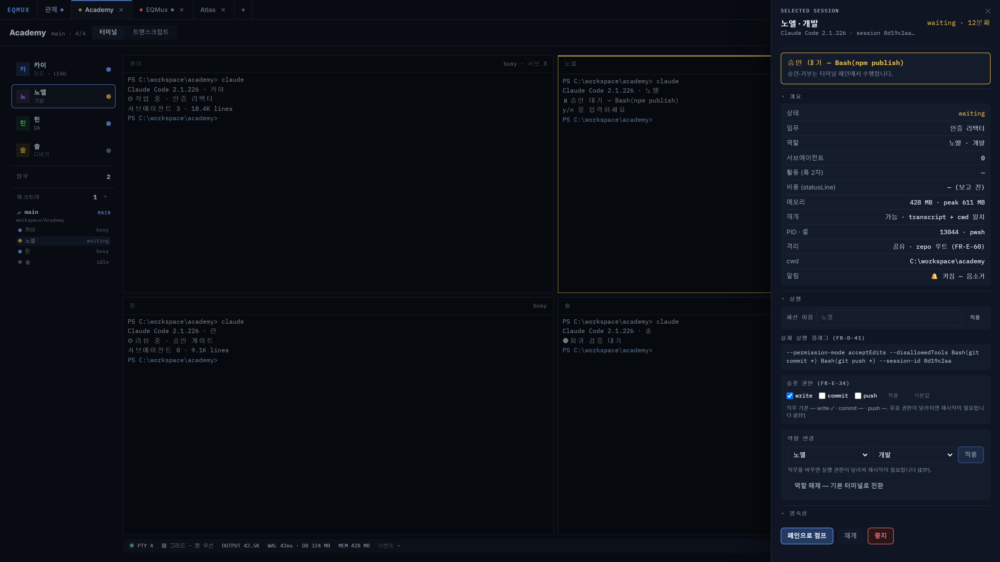

상태 · 임무 · 역할 · 서브에이전트 · 활동 · 비용 · 메모리 · 재개 가능 여부 · PID · cwd · 격리 방식과 함께, **실제 실행 플래그 원문**을 그대로 보여줍니다. 여기서 세션 이름 변경, 슬롯 권한 조정, 역할 변경, 점프·재개·중지를 할 수 있습니다.

### 재개와 재시작

- **재개** — 같은 세션 ID와 cwd로 `--resume`. 대화가 이어집니다. 재개 가능 여부는 트랜스크립트 존재로 실측합니다.
- **권한 재시작** — 권한이 바뀌면 재시작 배지가 뜹니다. 재개 기반으로 다시 띄우므로 대화는 유지됩니다.
- **자동 재시작 없음** — 프로세스가 죽으면 `dead`로 표시만 하고 되살리지 않습니다. 자동 재시작은 크래시 루프를 만들기 때문입니다.

### 알림

| 항목 | 동작 |
|---|---|
| 대상 | `waiting` · `dead` 진입 2종만 |
| 억제 | 앱 창에 포커스가 있으면 알리지 않음 |
| 합침 | 세션당 최소 60초 간격, 그 사이 발생분은 "(N건 합침)" |
| 음소거 | 세션·워크스페이스 단위. 알림만 막고 인앱 미확인 표시는 유지 |
| 의도한 종료 | 사용자가 중지한 세션의 `dead`는 알리지 않음 |

미확인 표시는 세션 셀 → 워크스페이스 탭 → 관제 탭으로 전파되고, 해당 페인을 보거나 상세를 열면 해제됩니다.

### 관측 저하(degraded)

에이전트 상태를 읽는 경로에 접근할 수 없게 되면 살아 있는 세션에 **"낮은 신뢰"** 뱃지가 붙습니다. 그동안에도 앱은 계속 동작하고, 접근이 회복되면 자동으로 해제됩니다. 이 전환은 이벤트 피드에 기록됩니다 — 조용히 열화되지 않습니다.

---

## 대화

사이드 패널 **개요** 탭이 에이전트 간 대화 스트림입니다.

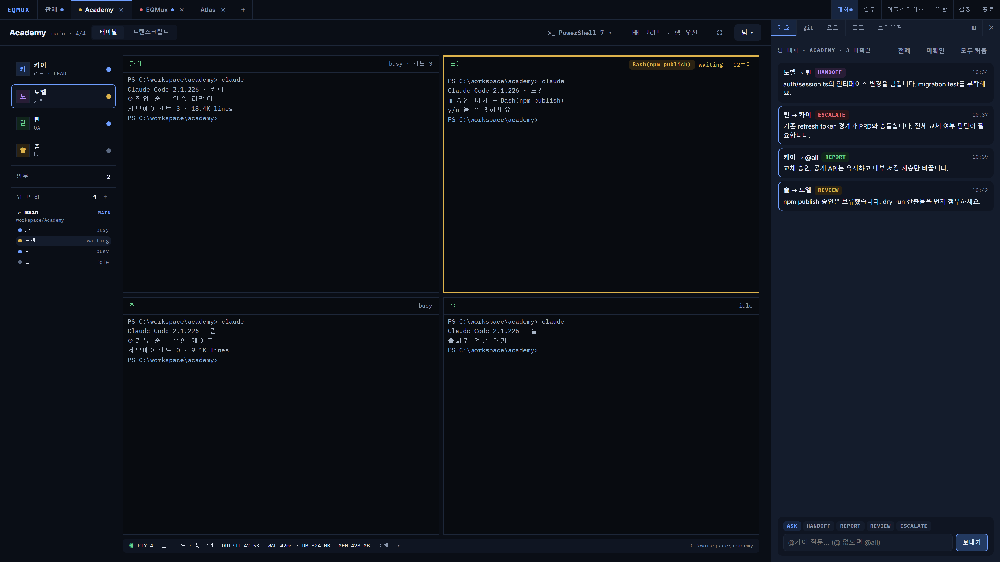

### 메시지 타입 5종

| 타입 | 쓰임 |
|---|---|
| `ask` | 질문 |
| `handoff` | 작업 넘기기 |
| `report` | 진척 보고 |
| `review` | 검토 요청·결과 |
| `escalate` | 판단 요청 (막혔을 때) |

**자유 텍스트는 거부됩니다.** 타입이 강제되어야 잡담이 아니라 업무 전달이 됩니다.

### 전달 규칙

수신 세션이 `idle`이면 즉시 전달하고, 작업 중이면 인박스에 쌓았다가 **턴이 끝날 때** 흘려보냅니다. `waiting` 상태에는 즉시 넣지 않습니다 — TUI 다이얼로그에 키가 잘못 들어가는 것을 막기 위해서입니다. 대기 중인 메시지는 탭 상단에 "누구 몇 건"으로 표시되고 재시작 후에도 유지됩니다.

### 사람의 참여

`@페르소나이름 내용` 형식으로 멘션하면 그 세션에게, 멘션을 생략하면 살아 있는 에이전트 전원에게 갑니다. 발신 상한은 발신자당 분당 10건, 본문 2,000자입니다.

---

## 코드 검토

### git 패널

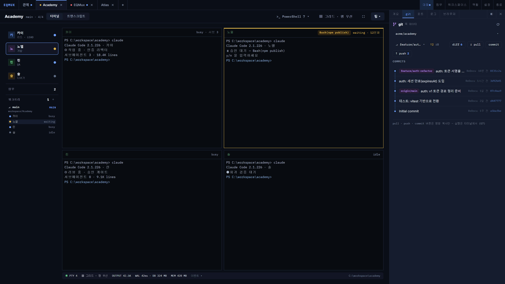

한 줄 툴바에 저장소 선택 · 브랜치 · ahead/behind · 액션 버튼이 있습니다.

- **diff** — HEAD ↔ 워크트리 비교를 엽니다
- **pull · commit · push** — 명령을 **클립보드에 복사만** 합니다. 실행은 터미널에서 사람이 합니다
- **커밋 목록** — 행을 클릭하면 부모 커밋과의 diff가 열립니다
- **브랜치** — 클릭 체크아웃(2단 확인) · 새 브랜치 생성
- **워크트리** — 목록 · 생성 · 기존 브랜치 연결 · 그 트리에서 셸 열기

### diff 뷰어

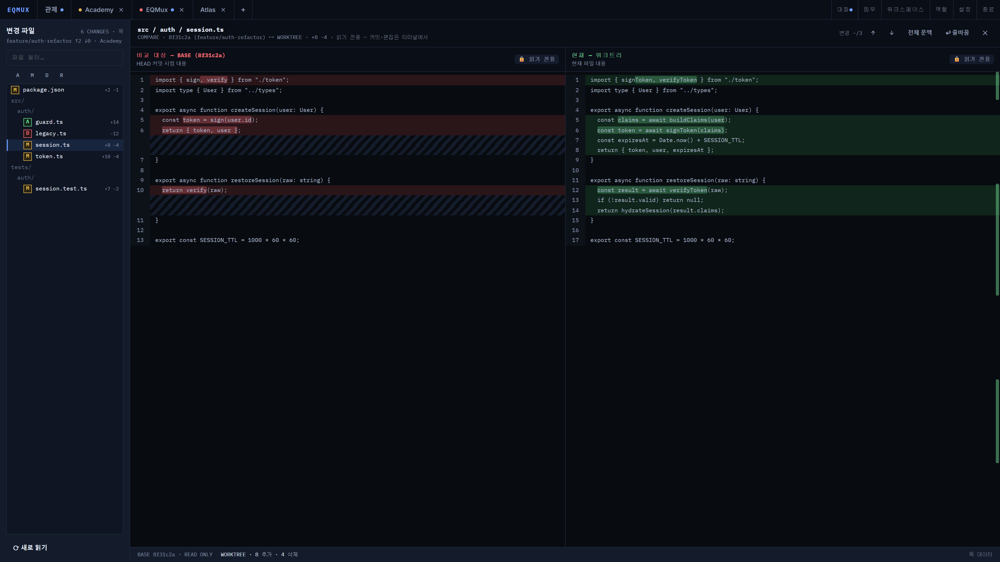

왼쪽에 변경 파일 트리(A/M/D/R 상태), 오른쪽에 나란히 비교. 읽기 전용이며 스테이지·커밋은 터미널에서 합니다.

### 워크트리 격리

세션마다 작업 트리를 분리하면 에이전트끼리 파일이 섞이지 않습니다.

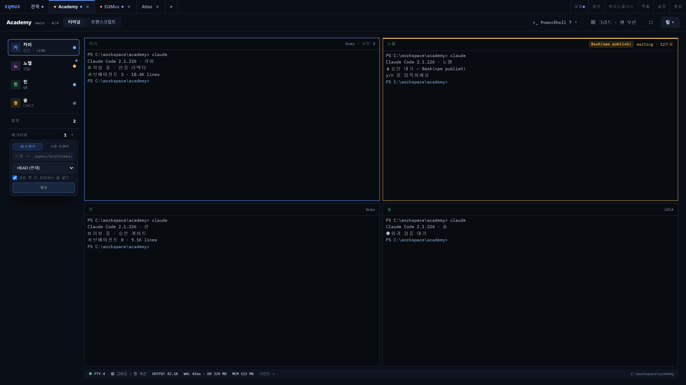

역할 세션을 만들 때 체크박스로 켜면 `.eqmux/worktrees/<세션>`과 전용 브랜치가 만들어집니다. 좌측 레일의 워크트리 섹션에서 트리별로 어떤 세션이 도는지 볼 수 있고, `+`로 새 트리를 만들거나 기존 브랜치를 연결할 수 있습니다.

**워크트리 삭제 기능은 없습니다** — 머지와 정리는 사람의 몫입니다.

### 에디터

파일 탐색기에서 파일을 열면 CodeMirror 기반 편집기가 열립니다. 100여 개 언어 문법 강조, `Ctrl+S` 저장, 그리고 두 가지 안전장치가 있습니다.

- **외부 변경 충돌 감지** — 편집하는 동안 에이전트가 같은 파일을 바꿨으면 저장을 거부합니다
- **미저장 이탈 보호** — 저장하지 않고 다른 파일로 이동하려 하면 한 번 경고합니다

### 트랜스크립트

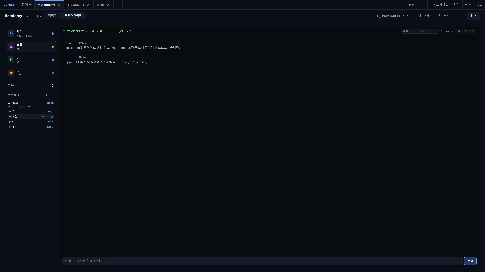

에이전트의 대화 로그를 턴 단위로 봅니다. 로그 파일을 **참조만** 하고 복사하지 않으며, 파일 끝 2MB만 읽어 큰 로그에서도 가볍습니다. 도구 호출은 기본 접힘이고 펼치면 입력·출력이 보입니다. 아래 입력창에 쓴 내용은 그대로 터미널로 전달됩니다.

---

## 영속성과 복구

### 무엇이 저장되나

| 대상 | 저장소 |
|---|---|
| 스크롤백 · 이벤트 · 대화 | 워크스페이스별 SQLite (WAL) |
| 설정 · 레이아웃 | JSON |
| 팀 · 역할 · 임무 | `.eqmux/` 파일 |

스크롤백은 **색(SGR)까지 보존**되어 재생 시 원래 색으로 나옵니다(설정에서 끄면 용량이 줄어듭니다). 보존 정책은 30일 · 세션당 줄 수 상한 · 전역 2GB이고, 먼저 닿는 것부터 정리합니다.

### 재시작하면

1. 열린 탭 · 페인 배치 · 분할 비율 · 선택 세션이 복원됩니다
2. 각 페인에 마지막 500줄이 흐리게 재생되고 경계선이 표시됩니다
3. 역할 세션에는 **재개 제안 카드**가 뜹니다 — `이전 대화 재개` / `새 대화` / `셸` 중 선택
4. 재개할 수 없으면 그 이유를 함께 보여줍니다

**자동으로 실행되는 것은 없습니다.**

### 비정상 종료 후

크래시 후 첫 실행에서 직전 세션 목록과 마지막 활동 시각, 재개 가능 여부를 보여줍니다. 여기서도 자동 재실행은 하지 않고, 실제 재개는 페인의 제안 카드가 담당합니다.

### 화면이 죽어도

터미널은 Rust 백엔드가 소유하므로 렌더러(웹뷰)가 죽어도 세션은 계속 살아 있습니다. 화면이 자동으로 다시 뜨고 살아 있는 세션에 재부착됩니다.

### 종료

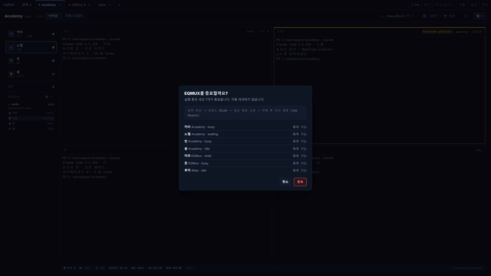

창을 닫으면 앱이 완전히 종료됩니다(트레이 상주 없음). 실행 중인 세션이 있으면 목록과 재개 가능 여부를 보여주고 확인을 받습니다. 종료 시퀀스는 저장 flush → 전 세션에 Ctrl+C → 유예 후 프로세스 트리 정리 순입니다. 세션마다 Job Object로 자식 프로세스를 묶어두므로 **고아 프로세스가 남지 않습니다.**

---

## 설정

앱 바 **설정** 버튼으로 엽니다.

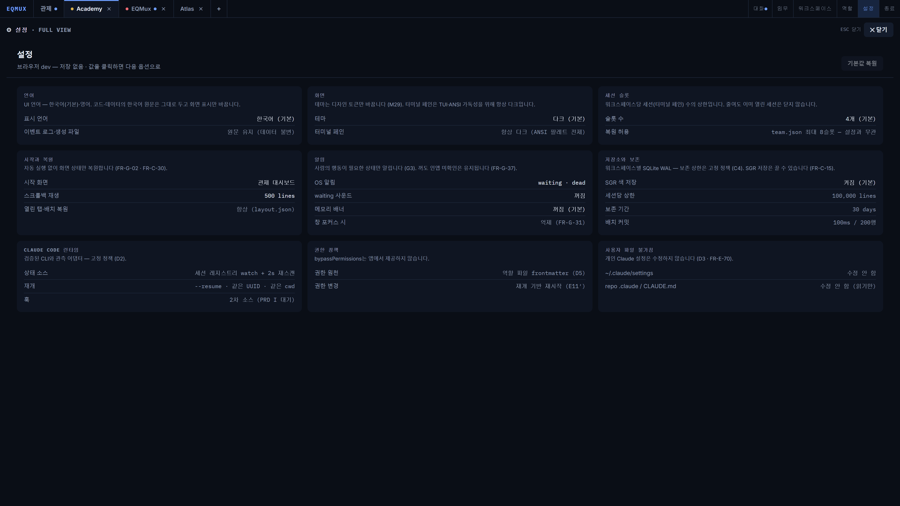

| 설정 | 옵션 (기본값 **굵게**) |
|---|---|
| 표시 언어 | **한국어** / English |
| 테마 | **다크** / 라이트 / 시스템 |
| 세션 슬롯 수 | **4** / 6 / 8 |
| 시작 화면 | **관제 대시보드** / 마지막 워크스페이스 |
| 스크롤백 재생 줄 수 | **500** / 1,000 / 2,000 |
| OS 알림 | **waiting · dead** / waiting만 / 끄기 |
| waiting 사운드 | 켜기 / **끄기** |
| 메모리 배너 임계값 | **꺼짐** / 2GB / 4GB / 8GB |
| SGR 색 저장 | **켜기** / 끄기 |

**언어 설정 주의** — UI 표시만 바뀝니다. 이벤트 로그, 페르소나·직무 파일 내용, 터미널 출력, git 결과 같은 **데이터는 번역하지 않습니다.**

보존 상한 · 권한 정책 · 불가침 항목은 화면에 선언만 되어 있고 설정으로 바꿀 수 없습니다.

---

## 단축키

| 키 | 동작 |
|---|---|
| `Ctrl+Shift+D` | 관제 탭 토글 (다시 누르면 직전 워크스페이스) |
| `Ctrl+Shift+L` | 페인 배치 선택 |
| `Ctrl+F` | 터미널 내 검색 (`Enter` 다음 · `Shift+Enter` 이전 · `ESC` 닫기) |
| `Ctrl+S` | 에디터 저장 |
| `Ctrl+Shift+C` / `Ctrl+Shift+V` | 터미널 복사 / 붙여넣기 |
| `ESC` | 팝업·오버레이 닫기 → 줌 해제 → 전체 화면 해제 순 |

터미널 페인을 우클릭하면 복사·검색·배치·줌·세션 상세·트랜스크립트 등 대부분의 액션에 바로 갈 수 있습니다.

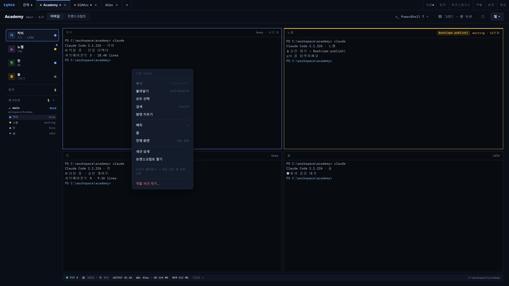

---

## eqmux CLI

에이전트가 앱과 대화하는 통로입니다. 앱이 띄운 터미널에서는 `PATH`에 이미 잡혀 있습니다.

### `eqmux send`

다른 에이전트나 사람에게 메시지를 보냅니다.

```bash
eqmux send --type handoff --to @린 "session.ts 인터페이스 변경을 넘깁니다. migration test 부탁해요."
eqmux send --type escalate "refresh token 경계가 PRD와 충돌합니다. 판단이 필요합니다."
```

| 옵션 | 설명 |
|---|---|
| `--type` | `ask` · `handoff` · `report` · `review` · `escalate` (필수) |
| `--to` | `@페르소나이름`. 생략하면 살아 있는 에이전트 전원 |

사람이 보내는 메시지와 완전히 같은 경로를 쓰므로 검증과 상한(분당 10건 · 2,000자)도 공유합니다.

### `eqmux report`

진척을 한 줄로 보고합니다. 대화 스트림과 세션 이벤트 피드에 동시에 기록됩니다.

```bash
eqmux report "auth/session.ts 리팩터 완료 — 테스트 12개 통과"
```

### `eqmux ping`

앱과 연결되는지 확인합니다.

### 내부 명령

`eqmux _hook` · `eqmux _statusline`은 앱이 에이전트에 주입하는 내부 진입점입니다. 직접 호출할 필요가 없습니다. 어떤 실패에도 종료 코드 0을 반환해 에이전트의 흐름을 막지 않습니다.

---

## 파일 구조

### 저장소 안 (`.eqmux/`)

| 파일 | 역할 | 커밋 |
|---|---|---|
| `team.json` | 팀 편성 원본 | ✅ |
| `team.md` | 에이전트·사람이 읽는 표 (파생) | ✅ |
| `roles/<세션>.md` | 세션별 역할. frontmatter의 `permissions`가 실행 권한을 결정 | gitignore |
| `missions/*.md` | 임무 정의 (브랜치 + 목표) | ✅ |
| `worktrees/<이름>/` | 워크트리 | gitignore |

`.eqmux/.gitignore`는 앱이 자동으로 만들어 `roles/`와 `worktrees/`를 제외합니다.

### 앱 데이터 (사용자 프로필)

| 위치 | 내용 |
|---|---|
| `jobs/*.md` · `personas/*.md` | 직무 · 페르소나 라이브러리 (전역) |
| `presets/*.json` | 편성 프리셋 |
| `settings.json` · `layout.json` | 설정 · 레이아웃 |
| `workspaces/<id>/session.db` | 워크스페이스별 SQLite |
| `~/.eqmux/logs/<세션>.log` | 세션 원문 로그 |

라이브러리는 **전역 + 워크스페이스 오버라이드** 2단입니다. 워크스페이스의 `.eqmux/`에 같은 id의 파일을 두면 그쪽이 이깁니다.

### 역할은 어떻게 전달되나

앱은 사용자의 `CLAUDE.md`를 수정하지 않습니다. 대신

1. 환경변수로 역할 파일 경로를 알려주고
2. `--append-system-prompt`로 **포인터 두 줄**만 붙입니다

에이전트가 그 파일을 읽습니다. 파일이 원본이고 프롬프트는 포인터일 뿐입니다.

---

## 문제 해결

**에이전트를 실행했는데 대시보드에 배지가 안 뜹니다.**
감지는 프로세스 트리를 5초 주기로 스캔합니다. 잠시 기다려 보세요. 계속 안 뜨면 그 세션의 터미널에서 실행한 것이 맞는지(다른 창이 아닌지) 확인하세요.

**상태 라벨 옆에 "낮은 신뢰" 뱃지가 있습니다.**
에이전트 상태 레지스트리에 접근할 수 없는 상태입니다. 상태는 훅과 프로세스 생존만으로 유지되며, 접근이 회복되면 자동으로 사라집니다. 앱 동작에는 문제가 없습니다.

**재개 버튼이 비활성입니다.**
재개는 트랜스크립트와 작업 디렉터리가 모두 맞아야 가능합니다. 세션 상세 패널의 `재개` 행에 사유가 표시됩니다. 워크트리를 지웠거나 다른 머신에서 clone한 저장소라면 새로 시작해야 합니다.

**권한을 바꿨는데 반영이 안 됩니다.**
실행 권한은 프로세스 수명 동안 고정입니다. 재시작 배지를 눌러 재개 기반 재시작을 하면 대화를 유지한 채 반영됩니다.

**commit / push 버튼을 눌렀는데 아무 일도 없습니다.**
의도된 동작입니다. 명령이 클립보드에 복사되었으니 터미널에 붙여넣어 실행하세요. 앱은 git 이력을 조작하지 않습니다.

**브라우저 패널에 외부 사이트가 안 열립니다.**
브라우저 패널은 `localhost` · `127.0.0.1` 전용입니다. 외부 URL은 기본 브라우저로 보냅니다.

**터미널 색이 이상합니다 / 라이트 테마인데 터미널만 어둡습니다.**
의도된 설계입니다. 터미널 페인은 ANSI 색 팔레트를 전제로 하므로 어느 테마에서든 다크로 유지됩니다.

**세션을 지웠는데 워크트리가 남아 있습니다.**
의도된 동작입니다. 머지되지 않은 작업이 사라지는 것을 막기 위해 워크트리는 보존합니다. 정리는 터미널에서 직접 하세요.

---

## 설계 경계

아래는 미구현이 아니라 **의도적으로 하지 않는 것**입니다.

| 하지 않는 것 | 이유 |
|---|---|
| API 키 보유 | 자체 AI 루프가 없습니다. 인증은 사용자의 CLI가 소유합니다 |
| 자동 실행 · 자동 재개 · 자동 재시작 | 상태를 바꾸는 것은 언제나 사용자의 버튼입니다 |
| `bypassPermissions` 제공 | 권한 체계를 무의미하게 만듭니다 |
| git 이력 조작 (commit · push · 스테이지) | 실행은 사람이 터미널에서 합니다 |
| 워크트리 삭제 | 머지·정리는 사람의 몫입니다 |
| 프로세스 강제 종료 (포트 패널) | 관측 도구이지 조작 도구가 아닙니다 |
| 승인·거부 대행 | 에이전트 TUI에 키를 주입하지 않습니다 |
| 임의 웹 브라우징 | 브라우저 패널은 localhost 전용입니다 |
| 트레이 상주 | 창을 닫으면 완전히 종료됩니다 |
| 사용자 설정 수정 | `CLAUDE.md` · `~/.claude` · repo `.claude/`는 불가침입니다 |

---

## 더 읽을거리

- [기능 명세서](/docs/feature-spec) — 기능별 정확한 동작 정의
- [페르소나 작성 가이드](/docs/persona-guide)
- [캐릭터 시트 가이드](/docs/character-guide)
