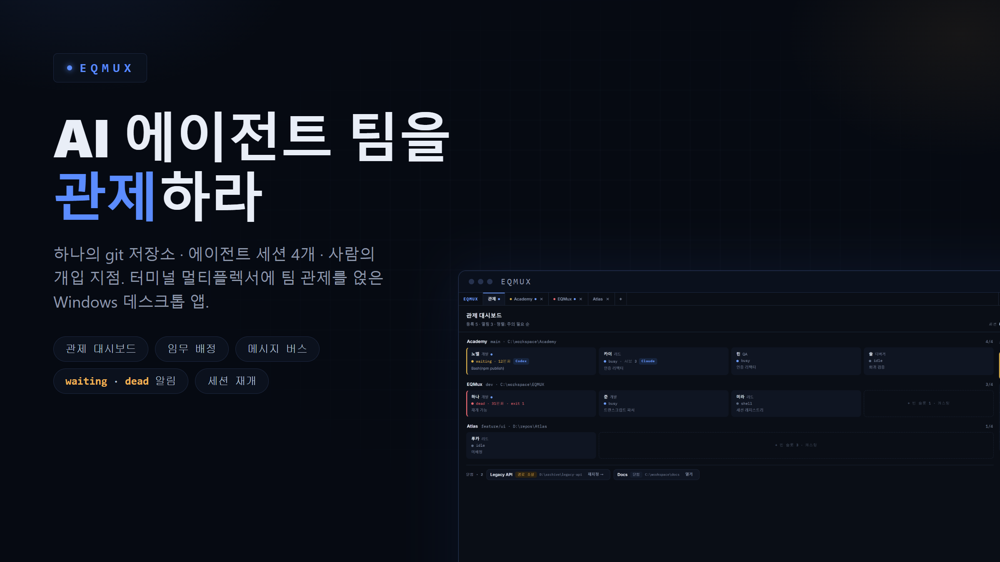
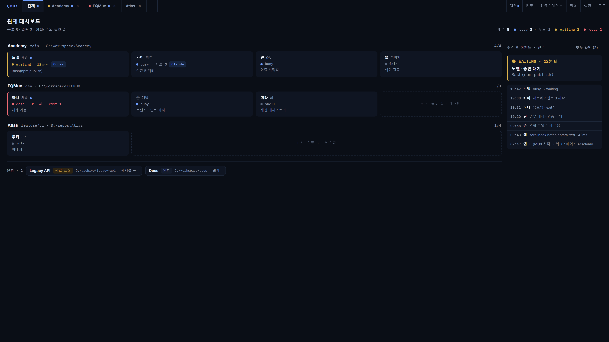
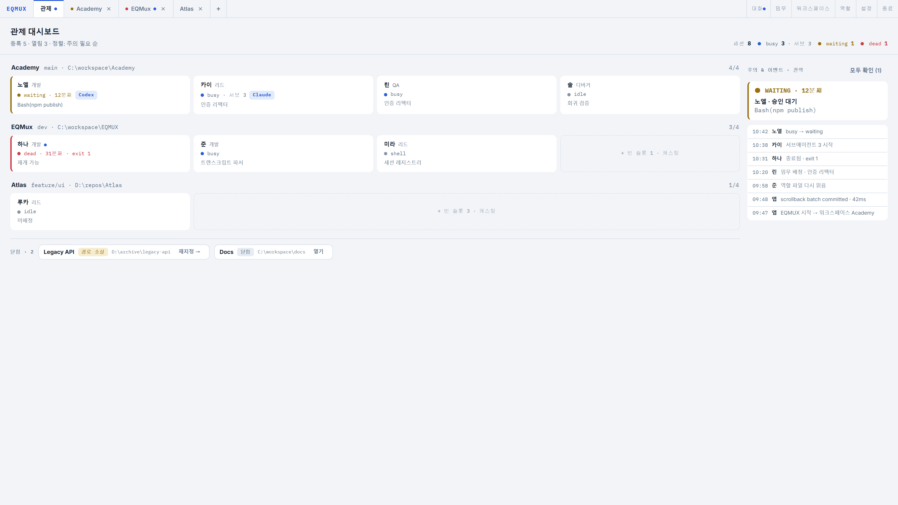

<!-- ═══════════ HERO ═══════════ -->

# AI 에이전트 팀을 관제하라

하나의 git 저장소 · 에이전트 세션 4개 · 사람의 개입 지점.
터미널 멀티플렉서에 팀 관제를 얹은 Windows 데스크톱 앱.

[**Windows용 다운로드**](/download) · [문서 보기](/docs)

`관제 대시보드` `임무 배정` `메시지 버스` `waiting · dead 알림` `세션 재개`

화면은 데모 데이터입니다.

<!-- ═══════════ 문제 제기 ═══════════ -->

## 터미널 4개를 알트탭으로 관제할 수는 없다

에이전트 CLI는 이미 훌륭하게 일합니다. 문제는 사람 쪽입니다 — 누가 승인을 기다리는지, 누가 죽었는지, 누가 무엇을 하고 있는지를 창 4개를 오가며 눈으로 쫓아야 합니다. EQMUX는 그 관제 업무를 화면 하나로 옮깁니다.

| 지금 | EQMUX |
|---|---|
| 승인 대기를 놓친다 | `waiting` 진입 즉시 OS 알림 — 창에 포커스가 있으면 억제하고, 반복은 합칩니다 |
| 죽은 세션을 늦게 발견한다 | `dead` 감지 + 재개 제안. 대화를 이어서 되살립니다 |
| 누가 뭘 하는지 모른다 | 상태 · 실행 중인 도구 · 서브에이전트 수 · 누적 비용 · 메모리를 실측해 보여줍니다 |

<!-- ═══════════ 3축 ═══════════ -->

## 보인다 · 맡긴다 · 믿는다

**보인다** — 팀 상태가 한눈에.
워크스페이스×세션 그리드가 주의가 필요한 순서로 정렬됩니다. 색은 `waiting`과 `dead`에만 씁니다.

**맡긴다** — 팀에게 일을 나눠준다.
직무 8종과 페르소나로 팀을 캐스팅하고, 임무를 배정하고, 에이전트끼리 업무를 주고받게 합니다.

**믿는다** — 앱은 선을 넘지 않는다.
API 키를 보유하지 않고, 아무것도 자동 실행하지 않고, git 이력을 조작하지 않습니다.

<!-- ═══════════ 기능 ① 관제 ═══════════ -->

## 보고, 배정하고, 개입한다

관제 탭은 앱을 켜면 가장 먼저 보이는 고정 탭입니다. 등록된 모든 워크스페이스가 행으로, 세션이 셀로 놓이고, 주의가 필요한 것이 위로 올라옵니다.

- **상태 6종 실시간** — `starting` · `busy` · `waiting` · `shell` · `idle` · `dead`. 폴링이 아니라 스트림 구독입니다.
- **에이전트 감지 배지** — 세션 프로세스 트리를 스캔해 실제로 돌고 있는 CLI(Claude · Codex · Gemini …)를 표시합니다. 터미널에서 직접 띄운 것도 잡힙니다.
- **알림은 2종만** — `waiting`과 `dead` 진입에만. 창에 포커스가 있으면 억제하고, 세션당 60초로 합칩니다.
- **액션은 세 개** — 점프 · 재개 · 중지. 승인·거부를 대신 눌러주지 않습니다.

세션 셀을 열면 인스펙터에 실행 플래그 원문, 재개 근거, 슬롯 권한, 메모리와 비용까지 그대로 나옵니다.

<!-- ═══════════ 기능 ② 터미널 ═══════════ -->

## 터미널이 작업 공간이다

EQMUX는 에이전트를 감싸는 채팅 UI가 아닙니다. 페인마다 진짜 터미널(ConPTY)이 있고, 실제 일은 거기서 벌어집니다.

- **배치 6종** — 그리드(행/열) · 세로 스택 · 가로 나열 · 메인+우측 · 메인+하단. `Ctrl+Shift+L`로 전환하고, 분할선을 끌어 비율을 조정합니다.
- **셸 4종** — PowerShell 7 · Windows PowerShell · Git Bash · cmd
- **터미널 내 검색** — `Ctrl+F`. TUI로 키를 흘려보내지 않고 검색 바를 엽니다.
- **클립보드 · 드래그 앤 드롭** — 이미지를 붙여넣으면 PNG로 저장하고 경로를 넣어줍니다.

배치·비율·열린 탭·선택 세션은 저장되어 다음 실행에 그대로 복원됩니다.

<!-- ═══════════ 기능 ③ 팀 ═══════════ -->

## 직무와 페르소나로 팀을 만든다

**직무**가 책임과 권한을 정하고, **페르소나**가 판단 성향을 정합니다. 둘은 분리되어 있습니다.

| | |
|---|---|
| **직무 8종 (고정)** | 리드 · 기획 · 개발 · 디자인 · QA · 디버거 · 문서 · 릴리즈 |
| **권한** | `write` / `commit` / `push` — push 권한은 리드와 릴리즈에만 |
| **페르소나 3단계** | 기본(판단 힌트) → 중간(+말투·성격) → 고급(캐릭터 시트) |
| **편성 프리셋** | 표준 · 집중개발 · 제품기획 · 품질 |

캐스팅 결과는 `.eqmux/team.json`과 사람이 읽는 `team.md`로 저장되고 repo와 함께 커밋됩니다. **팀 구성이 코드와 같이 이동합니다.**

<!-- ═══════════ 기능 ④ 임무·대화 ═══════════ -->

## 임무를 주고, 에이전트끼리 말하게 하라

임무는 `.eqmux/missions/*.md` 파일이 원본입니다 — 브랜치와 목표, 산출물 체크리스트. 배정하면 역할 파일에 임무 블록이 들어가고, 살아 있는 세션에는 한 줄 브리프가 전달됩니다.

에이전트 간 메시지는 다섯 타입이 강제됩니다 — `ask` · `handoff` · `report` · `review` · `escalate`. 잡담이 아니라 업무 전달입니다.

- 작업 중인 세션에는 **턴이 끝난 뒤** 전달되어 흐름을 끊지 않습니다
- 사람도 `@페르소나이름`으로 같은 스트림에 참여합니다
- 에이전트는 터미널에서 `eqmux send` · `eqmux report`로 합류합니다

<!-- ═══════════ 기능 ⑤ 검토 ═══════════ -->

## 에이전트가 만든 변경을 사람이 검토한다

git 패널에서 브랜치·워크트리·커밋을 보고, diff 뷰어에서 나란히 비교합니다. 커밋 행을 클릭하면 부모 커밋과의 차이가 열립니다.

- **워크트리 격리** — 세션마다 `.eqmux/worktrees/<세션>`에 전용 작업 트리를 두면 에이전트끼리 작업이 섞이지 않습니다
- **파일 탐색기 + 에디터** — 100여 개 언어 문법 강조, 외부 변경 충돌 감지, 미저장 이탈 보호
- **트랜스크립트** — 에이전트 대화 로그를 턴 단위로 열람. 참조만 하고 복사하지 않습니다

**단, `commit`과 `push`는 앱이 대신 눌러주지 않습니다.** 버튼은 명령을 클립보드에 복사할 뿐이고, 실행은 언제나 터미널에서 사람이 합니다.

<!-- ═══════════ 기능 ⑥ 영속성 ═══════════ -->

## 꺼도 사라지지 않는다

스크롤백은 색까지 그대로 SQLite에 저장되고, 재시작하면 마지막 500줄이 재생됩니다.

- **재개 제안** — 자동으로 되살리지 않습니다. `이전 대화 재개` / `새 대화` / `셸` 중에서 사람이 고릅니다
- **웹뷰 크래시 생존** — 화면이 죽어도 터미널은 Rust가 쥐고 있어 그대로 이어집니다
- **고아 프로세스 0** — 세션마다 Job Object로 자식 트리를 묶습니다
- **전문 검색** — 저장된 모든 스크롤백을 워크스페이스 전체에서 찾습니다

<!-- ═══════════ 신뢰 원칙 ═══════════ -->

## 하지 않는 것이 곧 설계다

에이전트에게 repo를 맡기는 도구는, 무엇을 할 수 있는지보다 **무엇을 하지 않는지**가 중요합니다.

| 하지 않는 것 | 이유 |
|---|---|
| **API 키를 보유하지 않는다** | 자체 AI 루프가 없습니다. 인증과 과금은 사용자의 CLI 몫입니다 |
| **아무것도 자동 실행하지 않는다** | 재시작 후에도 자동 재개 대신 제안만 띄웁니다 |
| **git 이력을 조작하지 않는다** | commit · push · 스테이지 버튼이 없습니다 (명령 복사만) |
| **승인을 대신 누르지 않는다** | 에이전트 TUI에 키를 주입하지 않습니다 |
| **사용자 설정을 건드리지 않는다** | `CLAUDE.md` · `~/.claude` · repo `.claude/`는 불가침입니다 |
| **파일이 원본이다** | 팀 · 역할 · 임무는 `.eqmux/` 파일. DB는 캐시일 뿐이고, 불일치하면 파일이 이깁니다 |

<!-- ═══════════ 스펙 ═══════════ -->

## 스펙

| 항목 | 내용 |
|---|---|
| 플랫폼 | Windows 10/11 (WebView2) |
| 설치 | NSIS 인스톨러 · 관리자 권한 불요 · 한국어/영어 |
| 에이전트 | Claude Code CLI (별도 설치·로그인 필요) |
| 규모 | 워크스페이스 동시 10개 · 워크스페이스당 세션 4개 (설정으로 6·8) |
| UI 언어 | 한국어 · English |
| 기술 | Tauri 2 (Rust) · SolidJS · ConPTY + xterm.js · SQLite (WAL) |

다크 · 라이트 · 시스템 테마를 지원합니다. 터미널 페인은 ANSI 색 가독성을 위해 어느 테마에서든 다크로 유지됩니다.

<!-- ═══════════ FAQ ═══════════ -->

## 자주 묻는 질문

**API 키를 넣어야 하나요?**
아니요. EQMUX는 API 키를 보유하지 않습니다. 이미 로그인된 Claude Code CLI를 실행할 뿐이고, 인증과 과금은 전부 CLI 쪽에서 일어납니다.

**Claude Code가 꼭 필요한가요?**
에이전트 세션 기능(상태 감지 · 재개 · 역할 전달)은 1차로 Claude Code를 지원합니다. 다만 모든 세션은 일반 셸로도 쓸 수 있고, 터미널에서 직접 띄운 Codex · Gemini 같은 다른 CLI도 관제 대시보드가 감지해 표시합니다.

**에이전트가 마음대로 커밋하거나 push하지 않나요?**
실행 권한은 직무별로 역할 파일에 명시되고 에이전트 실행 플래그로 강제됩니다. push 권한은 기본적으로 리드·릴리즈 직무에만 있습니다. 앱 자체는 git 이력을 바꾸는 어떤 버튼도 제공하지 않습니다.

**앱을 끄면 작업 내용이 사라지나요?**
스크롤백 · 이벤트 · 대화는 SQLite에 저장되고 재시작하면 화면과 함께 복원됩니다. 에이전트 대화는 재개 제안 카드에서 한 번의 클릭으로 이어집니다.

**세션이 왜 4개인가요?**
리소스가 아니라 가독성 한계입니다 — 1920×1080에서 2×2 분할이 에이전트 TUI를 읽을 수 있는 한계입니다. 설정에서 6·8개로 늘릴 수 있습니다.

**macOS / Linux는요?**
현재는 Windows 우선입니다 (ConPTY · Job Object · WebView2 기반).

<!-- ═══════════ CTA ═══════════ -->

## 팀은 준비됐다. 관제탑만 세우면 된다.

[**EQMUX 다운로드 (Windows x64)**](/download)

[시작 가이드](/docs#시작하기) · [기능 문서](/docs) · [자주 묻는 질문](/docs#faq)
